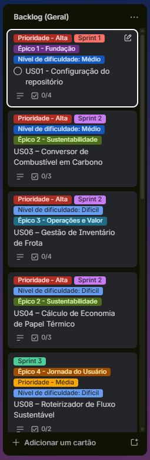
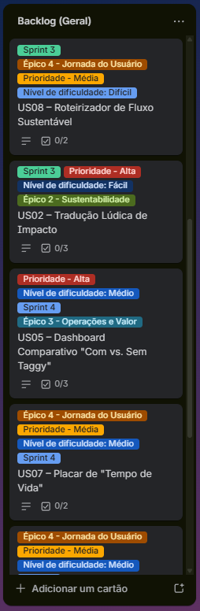

# Projeto Taggy: Mobilidade Sustentável 🌿

O _Taggy_ é uma solução de pagamento automático (Tag) que vai além da conveniência. Nosso objetivo é transformar cada passagem por pedágios e estacionamentos em dados acionáveis de sustentabilidade (ESG), economia de combustível e eficiência operacional.

## 📌 Sumário

- [Visão Geral](#visão-geral)
- [Público-Alvo (Personas)](#público-alvo-personas)
- [Estrutura do Projeto](#estrutura-do-projeto)
- [User Stories](#user-stories)
- [Backlog (Trello)](#backlog-trello)
- [Evidências (prints)](#evidências-prints)
- [Equipe](#equipe)

---

## 🚀 Visão Geral

O sistema utiliza a inteligência de dados para calcular o impacto ambiental positivo gerado pela fluidez no trânsito. Focamos em três pilares:

1. _Inteligência:_ Cálculos baseados no GHG Protocol para CO₂ e economia de diesel.
2. _Engajamento:_ Linguagem lúdica para aproximar o usuário da causa ambiental.
3. _Gestão:_ Dashboards robustos para frotas que buscam certificados ESG.

## 👥 Público-Alvo (Personas)

- _Mariana Costa (Sustentabilidade):_ Precisa de dados auditáveis para relatórios anuais.
- _Ricardo Almeida (Operações):_ Focado em redução de custos de combustível e manutenção.
- _Tiago Mendes (Motorista):_ Valoriza praticidade, status e o "tempo ganho".
- _Jéssica Castro (Product Lead):_ Busca métricas de engajamento e diferenciais competitivos.

## 🛠 Estrutura do Projeto

O projeto está dividido em 5 pilares estratégicos:

- _Pilar 1:_ O Cálculo (Inteligência de Dados)
- _Pilar 2:_ Os Painéis (Visualização)
- _Pilar 3:_ Incentivos e Avisos (Gamificação)
- _Pilar 4:_ Conexão e Linguagem (UX Writing)
- _Pilar 5:_ Vantagens de Negócio (Certificações)

---

## 📋 User Stories

Versão detalhada (Card, Conversation e Confirmation): [docs/user-stories.md](docs/user-stories.md).

### 🟢 Prioridade Alta: Inteligência e Impacto

- _[US01-AL] Tradução Lúdica de Impacto:_ Metáforas visuais para impacto ambiental.
- _[US02-AL] Conversor de Combustível em Carbono:_ Cálculo técnico baseado no GHG Protocol.
- _[US03-AL] Cálculo de Economia de Papel Térmico:_ Mensuração de resíduos físicos evitados.
- _[US04-AL] Dashboard Comparativo "Com vs. Sem Taggy":_ Análise de ROI financeiro e ambiental.

### 🔵 Prioridade Média: Rotina e Experiência

- _[US05-ME] Placar de "Tempo de Vida":_ Acumulado de horas economizadas fora das filas.
- _[US06-ME] Roteirizador de Fluxo Sustentável:_ Sugestão de trajetos com menor pegada de carbono.
- _[US07-ME] Notificações "Passagem Limpa":_ Feedback imediato via push após o uso.

### 🟡 Prioridade Baixa: Diferenciais e Negócio

- _[US08-BA] Barra de Progresso de Metas Semanais:_ Gamificação para retenção do usuário.
- _[US09-BA] Calculadora de Payback Operacional:_ Demonstrativo de quando a economia paga a mensalidade.
- _[US10-BA] Certificado Anual de Impacto ESG:_ Documento oficial para marketing institucional.

---

## 📋 Backlog (Trello)

O backlog do projeto está organizado no quadro da equipe na disciplina, com cartões alinhados às user stories e prioridades. Acompanhe o estado das tarefas em: [Trello – cesar-projetos-2](https://trello.com/b/alfFb7dV/cesar-projetos-2).

## 📸 Evidências

Capturas de tela solicitadas para comprovar o backlog e a organização do trabalho no Trello. Os arquivos originais ficam em [`docs/images/`](docs/images/). No GitHub (e na maioria dos previews de Markdown), as figuras abaixo aparecem **embutidas** no README — basta que `docs/images/*.png` esteja versionado no repositório.

_Backlog no Trello:_

<table>
  <tr>
    <td align="center" valign="top" width="50%">
      
    </td>
    <td align="center" valign="top" width="50%">
      
    </td>
  </tr>
</table>

---

## 👥 Equipe e Papéis

| Nome              | Papel                   | E-mail             |
| :---------------- | :---------------------- | :----------------- |
| _Afonso Araujo_   | Analista de Automações  | ahma@cesar.school  |
| _Igor Phillipe_   | Desenvolvedor FullStack | ipara@cesar.school |
| _Williams Pontes_ | Desenvolvedor Back-End  | jwlp@cesar.school  |

---

Este projeto faz parte da disciplina de SI010 - Fundamentos de Desenvolvimento de Software.
