# Projeto Taggy

O _Taggy_ é uma solução de pagamento automático (Tag) que vai além da conveniência. Nosso objetivo é transformar cada passagem por pedágios e estacionamentos em dados acionáveis de sustentabilidade (ESG), economia de combustível e eficiência operacional.

---

## Visão Geral

O sistema utiliza a inteligência de dados para calcular o impacto ambiental positivo gerado pela fluidez no trânsito. Focamos em três pilares:

1. _Inteligência:_ Cálculos baseados no GHG Protocol para CO₂ e economia de diesel.
2. _Engajamento:_ Linguagem lúdica para aproximar o usuário da causa ambiental.
3. _Gestão:_ Dashboards robustos para frotas que buscam certificados ESG.

## Público-Alvo (Personas)

- _Mariana Costa (Sustentabilidade):_ Precisa de dados auditáveis para relatórios anuais.
- _Ricardo Almeida (Operações):_ Focado em redução de custos de combustível e manutenção.
- _Tiago Mendes (Motorista):_ Valoriza praticidade, status e o "tempo ganho".
- _Jéssica Castro (Product Lead):_ Busca métricas de engajamento e diferenciais competitivos.

## Estrutura do Projeto

O projeto está dividido em 5 pilares estratégicos:

- _Pilar 1:_ O Cálculo (Inteligência de Dados)
- _Pilar 2:_ Os Painéis (Visualização)
- _Pilar 3:_ Incentivos e Avisos (Gamificação)
- _Pilar 4:_ Conexão e Linguagem (UX Writing)
- _Pilar 5:_ Vantagens de Negócio (Certificações)

---

## User Stories

Versão detalhada (Card, Conversation e Confirmation) no Trello: [cesar-projetos-2](https://trello.com/b/alfFb7dV/cesar-projetos-2).

Diagramas de atividades (US02–US11): [arquivo draw.io no Google Drive](https://drive.google.com/file/d/1XGv4y-BJ-yUia8EKnrTdb78NESRhesFB/view?usp=drive_link).

### 🔴 Prioridade Alta: Fundação e entregas core

- _[US01] Configuração do repositório:_ Boilerplate front/back, qualidade de código e documentação mínima para onboarding.
- _[US02] Tradução Lúdica de Impacto:_ Metáforas visuais para impacto ambiental (carbono, água, papel).
- _[US03] Conversor de Combustível em Carbono:_ Cálculo ESG com GHG Protocol (leve flex / pesado diesel) e auditoria.
- _[US04] Cálculo de Economia de Papel Térmico:_ Papel (BPA) evitado, água poupada e árvores preservadas no dashboard.
- _[US05] Dashboard Comparativo "Com vs. Sem Taggy":_ ROI com delta em R$ e litros e filtros por veículo, placa ou período.
- _[US06] Gestão de Inventário de Frota:_ Cadastro de veículos e Tags com validações, lote (CSV/Excel) e CRUD.

### 🟡 Prioridade Média: Rotina e Experiência

- _[US07] Placar de "Tempo de Vida":_ Horas/dias ganhos com atualização após cada transação confirmada.
- _[US08] Roteirizador de Fluxo Sustentável:_ Rotas verdes no mapa e estimativa de CO₂ evitado antes do trajeto.
- _[US09] Notificações "Passagem Limpa":_ Push rápido com economia de combustível e CO₂ da passagem.

### 🟢 Prioridade Baixa: Diferenciais e Negócio

- _[US10] Barra de Progresso de Metas Semanais:_ Metas semanais configuráveis por frota ou perfil.
- _[US11] Calculadora de Payback Operacional:_ Saldo real (economia − mensalidade) e status "Tag Paga".

## Screencast do protótipo

Este screencast percorre o protótipo do Taggy: principais telas e fluxos e como eles se conectam às user stories e funcionalidades documentadas neste repositório.

**Assistir no YouTube:** [Screencast do protótipo Taggy](https://www.youtube.com/watch?v=7lFrXswsO0k)

[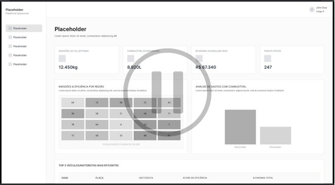](https://www.youtube.com/watch?v=7lFrXswsO0k)

---

## Sketches e storyboards do protótipo

Esta seção documenta os **sketches e storyboards** do produto. Existem **12 telas** em [`docs/images/mockup/`](docs/images/mockup/) (`01.png` … `12.png`). Na coluna **Arquivo**, cada nome de arquivo é um **link** para o PNG no repositório. Cada tela pode ilustrar **várias user stories** ao mesmo tempo: na tabela abaixo indicamos as **US principais** e as **relacionadas**.

Em conjunto, as 12 imagens cobrem **as 11 user stories**.

### Mapa telas ↔ user stories

| Tela | Arquivo                             | Descrição breve                                                                | US principais | US relacionadas  |
| :--- | :---------------------------------- | :----------------------------------------------------------------------------- | :------------ | :--------------- |
| 01   | [01.png](docs/images/mockup/01.png) | Dashboard mobile — aba Carbono (impacto lúdico + valor técnico em kg CO₂)      | US02, US03    | US04, US07, US10 |
| 02   | [02.png](docs/images/mockup/02.png) | Mesmo dashboard — aba Água (litros poupados)                                   | US02, US04    | US03, US07, US10 |
| 03   | [03.png](docs/images/mockup/03.png) | Mesmo dashboard — aba Papel (metragem evitada)                                 | US02, US04    | US03, US07, US10 |
| 04   | [04.png](docs/images/mockup/04.png) | Resumo e lista das últimas passagens (CO₂, combustível, tempo por passagem)    | US03, US07    | US05, US09       |
| 05   | [05.png](docs/images/mockup/05.png) | Notificação push na tela de bloqueio (praça, g CO₂, ml diesel, min ganhos)     | US09          | US03, US07       |
| 06   | [06.png](docs/images/mockup/06.png) | Perfil motorista (frota, placa, combustível; atalhos histórico / notificações) | US06          | US07, US09       |
| 07   | [07.png](docs/images/mockup/07.png) | Mapa — inserir destino / pesquisar (início da jornada de rota)                 | US08          | —                |
| 08   | [08.png](docs/images/mockup/08.png) | Rota Verde no mapa + painel Eco-estimativa (CO₂ evitado, tempo parado)         | US08          | US03, US07       |
| 09   | [09.png](docs/images/mockup/09.png) | Dashboard web operacional (KPIs, filtros, exportar ESG, heatmap, top 5)        | US05, US03    | US06, US10, US11 |
| 10   | [10.png](docs/images/mockup/10.png) | Registro de frota (tag, placa, modelo, combustível; CSV; editar / excluir)     | US06          | US03             |
| 11   | [11.png](docs/images/mockup/11.png) | Configurações — conta e calibração operacional (parâmetros de ROI)             | US11          | US01             |
| 12   | [12.png](docs/images/mockup/12.png) | Gerar relatórios com filtros e área de resultado                               | US03, US04    | US11, US01       |

### Galeria de mockups

Seleção das telas mais representativas; as demais permanecem na tabela acima e em [`docs/images/mockup/`](docs/images/mockup/).

<table>
  <tr>
    <td align="center" valign="top" width="50%">
      
<strong>Tela 01</strong> — Dashboard, aba Carbono

      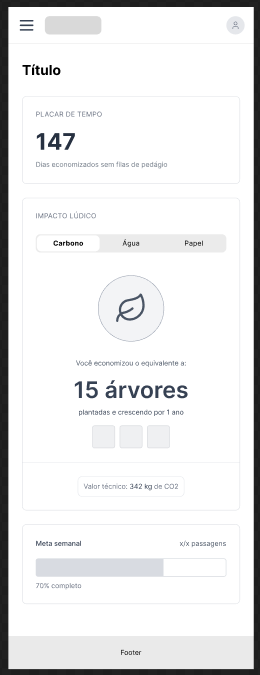
    </td>
    <td align="center" valign="top" width="50%">
      
<strong>Tela 04</strong> — Resumo e últimas passagens

      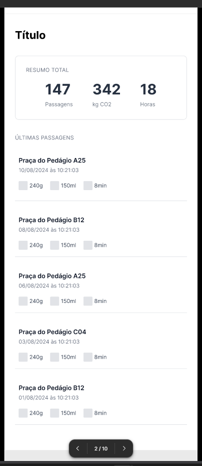
    </td>
  </tr>
  <tr>
    <td align="center" valign="top">
      
<strong>Tela 05</strong> — Notificação push

      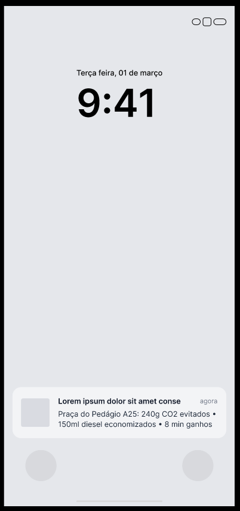
    </td>
    <td align="center" valign="top">
      
<strong>Tela 08</strong> — Rota Verde e eco-estimativa

      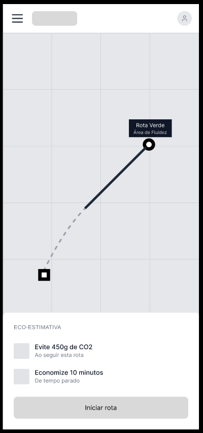
    </td>
  </tr>
  <tr>
    <td align="center" valign="top">
      
<strong>Tela 09</strong> — Dashboard web operacional

      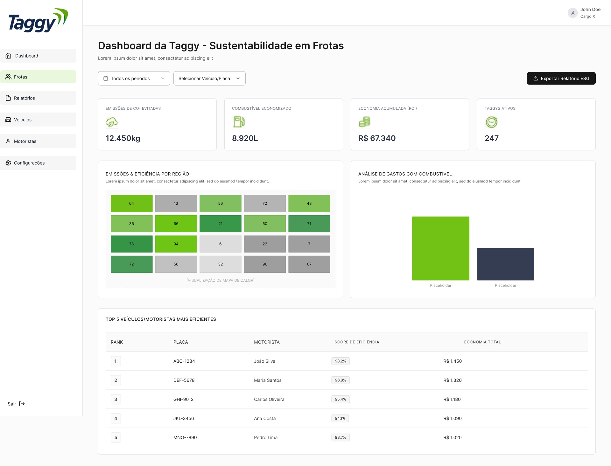
    </td>
    <td align="center" valign="top">
      
<strong>Tela 10</strong> — Registro de frota

      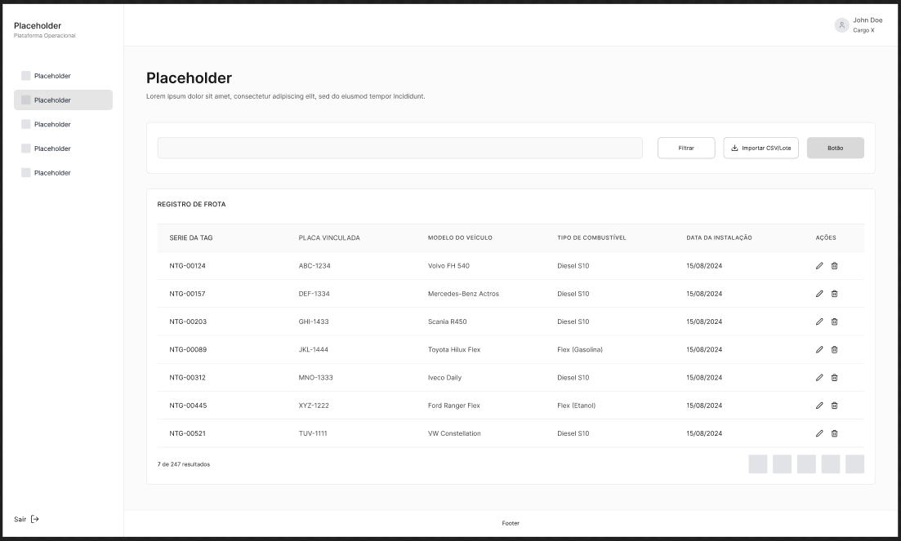
    </td>
  </tr>
</table>

## Diagramas de atividades (user stories)

Os **diagramas de atividades** (UML) das user stories **US02–US11** estão no arquivo draw.io (fonte editável e visão completa). A **US01** (configuração do repositório) não possui diagrama neste conjunto.

**[Abrir diagramas no draw.io — Google Drive](https://drive.google.com/file/d/1XGv4y-BJ-yUia8EKnrTdb78NESRhesFB/view?usp=drive_link)**

### Galeria de diagramas (exportados)

Exportações PNG em [`docs/diagramas/`](docs/diagramas/) — subconjunto das user stories de **prioridade alta**; o arquivo no Drive reúne **US02–US11** por completo.

<table>
  <tr>
    <td align="center" valign="top" width="50%">
      
<strong>US02</strong> — Tradução Lúdica de Impacto

      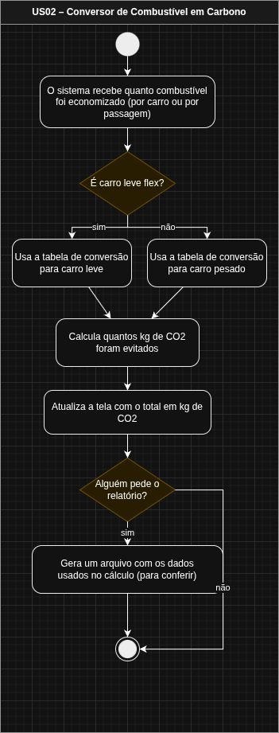
    </td>
    <td align="center" valign="top" width="50%">
      
<strong>US03</strong> — Conversor de Combustível em Carbono

      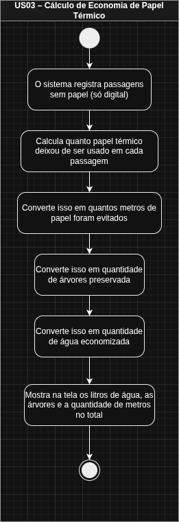
    </td>
  </tr>
  <tr>
    <td align="center" valign="top">
      
<strong>US05</strong> — Dashboard Comparativo Com vs Sem Taggy

      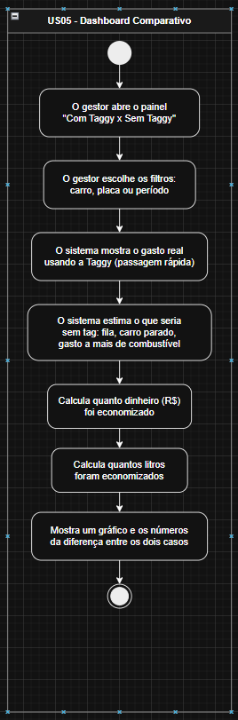
    </td>
    <td align="center" valign="top">
      
<strong>US06</strong> — Gestão de Inventário de Frota

      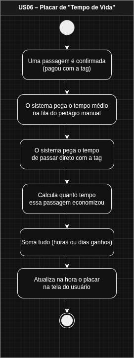
    </td>
  </tr>
</table>

---

## Backlog (Trello)

O backlog do projeto está organizado no quadro da equipe na disciplina, com cartões alinhados às user stories e prioridades. Acompanhe o estado das tarefas em: [Trello – cesar-projetos-2](https://trello.com/b/alfFb7dV/cesar-projetos-2).

### Sprint 1

Coluna _Backlog (Sprint)_ no Trello: **US03**, **US06**, **US04**.

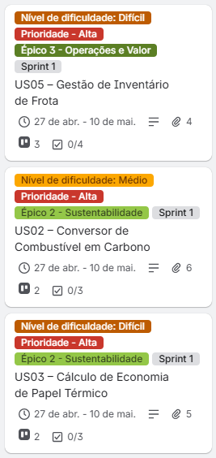

### Sprint 2

Coluna _Backlog (Sprint)_ no Trello: **US02**, **US05**.

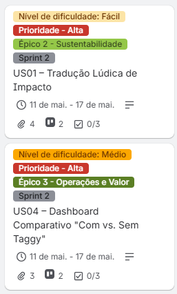

### Sprint 3

Coluna _Backlog (Sprint)_ no Trello: **US08**, **US07**, **US09**.

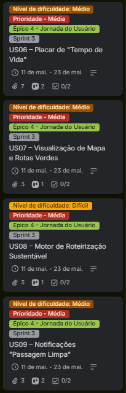

### Sprint 4

Coluna _Backlog (Sprint)_ no Trello: **US10**, **US11**.

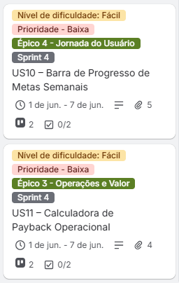

---

## Links importantes

Referências usadas no dia a dia do projeto — código, desenho da solução, modelagem e acompanhamento do backlog.

| Área                    | Link                                                                                                        |
| :---------------------- | :---------------------------------------------------------------------------------------------------------- |
| Código                  | [GitHub](https://github.com/WillPontes/FDS-Projetos2)                                                       |
| Backlog e Sprints       | [Trello](https://trello.com/b/alfFb7dV/cesar-projetos-2)                                                    |
| Wireframes              | [Figma](https://www.figma.com/design/ME63dOBQJ943GhMTh00W4g/Wireframe?node-id=0-1&p=f&t=KS4WtIegdrdhUasH-0) |
| Screencast              | [YouTube](https://www.youtube.com/watch?v=7lFrXswsO0k)                                                      |
| Diagramas de Atividades | [Google Drive](https://drive.google.com/file/d/1XGv4y-BJ-yUia8EKnrTdb78NESRhesFB/view?usp=drive_link)       |

---

## Equipe e Papéis

| Nome              | Papel                   | E-mail             | LinkedIn                                                         | GitHub                                      |
| :---------------- | :---------------------- | :----------------- | :--------------------------------------------------------------- | :------------------------------------------ |
| _Afonso Araujo_   | Desenvolvedor Back-End  | ahma@cesar.school  | [LinkedIn](https://www.linkedin.com/in/afonso-araujo-8ab810369/) | [GitHub](https://github.com/araujo1901mx)   |
| _Igor Phillipe_   | Tech Lead               | ipara@cesar.school | [LinkedIn](https://www.linkedin.com/in/igrphillipe/)             | [GitHub](https://github.com/IgrPhillipe)    |
| _Williams Pontes_ | Product Owner & Desenvolvedor Back-End  | jwlp@cesar.school  | [LinkedIn](https://www.linkedin.com/in/williams-pontes/)         | [GitHub](https://github.com/WillPontes)     |
| _Jean Augusto_    | Desenvolvedor Back-End  | jasm2@cesar.school | [LinkedIn](https://www.linkedin.com/in/jean-augusto-0562953b4/)  | [GitHub](https://github.com/jeanaugustox)   |
| _Lucas Gabriel_   | Desenvolvedor FullStack | lgcs2@cesar.school | [LinkedIn](https://www.linkedin.com/in/lucasgabrielcs/)          | [GitHub](https://github.com/lucasgabrielcs) |
| _Kellwen Costa_   | Desenvolvedor Back-End  | kilc@cesar.school  | [LinkedIn](https://www.linkedin.com/in/kellwencosta/)            | [GitHub](https://github.com/kellwencosta)   |

---

Este projeto faz parte da disciplina de SI010 - Fundamentos de Desenvolvimento de Software.
