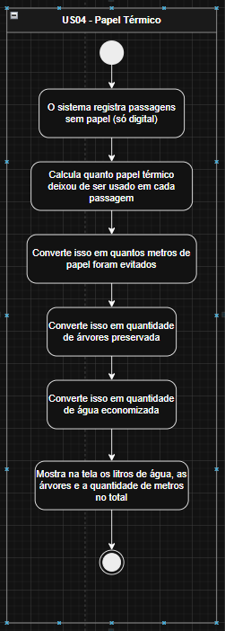
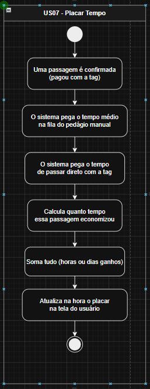
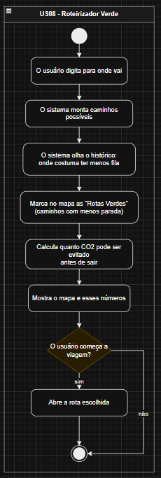
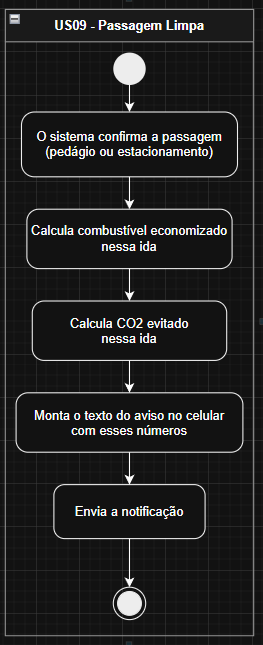
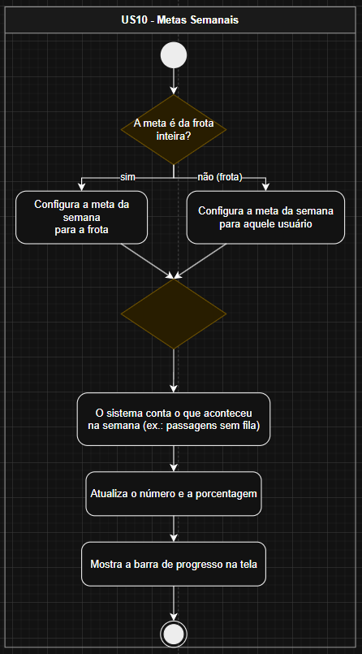
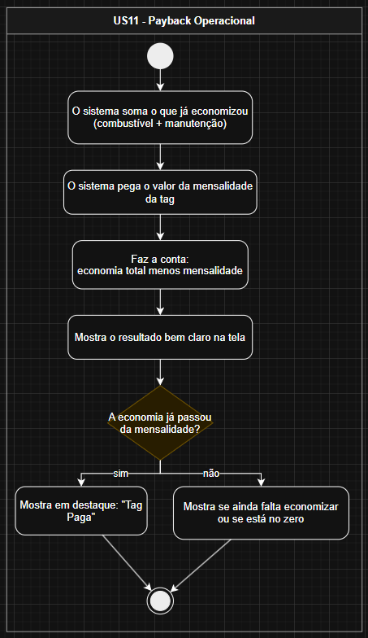

# Projeto Taggy

O _Taggy_ é uma solução de pagamento automático (Tag) que vai além da conveniência. Nosso objetivo é transformar cada passagem por pedágios e estacionamentos em dados acionáveis de sustentabilidade (ESG), economia de combustível e eficiência operacional.

---

## Visão Geral

O sistema utiliza a inteligência de dados para calcular o impacto ambiental positivo gerado pela fluidez no trânsito. Focamos em três pilares:

1. _Inteligência:_ Cálculos baseados no GHG Protocol para CO₂ e economia de diesel.
2. _Engajamento:_ Linguagem lúdica para aproximar o usuário da causa ambiental.
3. _Gestão:_ Dashboards robustos para frotas que buscam certificados ESG.

## Público-Alvo (Personas)

- _Mariana Costa (Sustentabilidade):_ Precisa de dados auditáveis para relatórios anuais.
- _Ricardo Almeida (Operações):_ Focado em redução de custos de combustível e manutenção.
- _Tiago Mendes (Motorista):_ Valoriza praticidade, status e o "tempo ganho".
- _Jéssica Castro (Product Lead):_ Busca métricas de engajamento e diferenciais competitivos.

## Estrutura do Projeto

O projeto está dividido em 5 pilares estratégicos:

- _Pilar 1:_ O Cálculo (Inteligência de Dados)
- _Pilar 2:_ Os Painéis (Visualização)
- _Pilar 3:_ Incentivos e Avisos (Gamificação)
- _Pilar 4:_ Conexão e Linguagem (UX Writing)
- _Pilar 5:_ Vantagens de Negócio (Certificações)

---

## User Stories

Versão detalhada (Card, Conversation e Confirmation): [docs/user-stories.md](docs/user-stories.md).

Diagramas de atividades (US02–US11) estão na [seção Diagramas de atividades](#diagramas-de-atividades-user-stories); o walkthrough do protótipo está no [screencast](#screencast-do-prototipo).

### 🔴 Prioridade Alta: Fundação e entregas core

- _[US01] Configuração do repositório:_ Boilerplate front/back, qualidade de código e documentação mínima para onboarding.
- _[US02] Tradução Lúdica de Impacto:_ Metáforas visuais para impacto ambiental (carbono, água, papel).
- _[US03] Conversor de Combustível em Carbono:_ Cálculo ESG com GHG Protocol (leve flex / pesado diesel) e auditoria.
- _[US04] Cálculo de Economia de Papel Térmico:_ Papel (BPA) evitado, água poupada e árvores preservadas no dashboard.
- _[US05] Dashboard Comparativo "Com vs. Sem Taggy":_ ROI com delta em R$ e litros e filtros por veículo, placa ou período.
- _[US06] Gestão de Inventário de Frota:_ Cadastro de veículos e Tags com validações, lote (CSV/Excel) e CRUD.

### 🟡 Prioridade Média: Rotina e Experiência

- _[US07] Placar de "Tempo de Vida":_ Horas/dias ganhos com atualização após cada transação confirmada.
- _[US08] Roteirizador de Fluxo Sustentável:_ Rotas verdes no mapa e estimativa de CO₂ evitado antes do trajeto.
- _[US09] Notificações "Passagem Limpa":_ Push rápido com economia de combustível e CO₂ da passagem.

### 🟢 Prioridade Baixa: Diferenciais e Negócio

- _[US10] Barra de Progresso de Metas Semanais:_ Metas semanais configuráveis por frota ou perfil.
- _[US11] Calculadora de Payback Operacional:_ Saldo real (economia − mensalidade) e status "Tag Paga".

## Screencast do protótipo

Este screencast percorre o protótipo do Taggy: principais telas e fluxos e como eles se conectam às user stories e funcionalidades documentadas neste repositório.

**Assistir no YouTube:** [Screencast do protótipo Taggy](https://www.youtube.com/watch?v=7lFrXswsO0k)

---

## Sketches e storyboards do protótipo

Esta seção documenta os **sketches e storyboards** do produto. Existem **12 telas** em [`docs/images/mockup/`](docs/images/mockup/) (`01.png` … `12.png`). Cada tela pode ilustrar **várias user stories** ao mesmo tempo: na tabela abaixo indicamos as **US principais** e as **relacionadas**.

Em conjunto, as 12 imagens cobrem **as 11 user stories**.

### Mapa telas ↔ user stories

| Tela | Arquivo  | Descrição breve                                                                | US principais | US relacionadas  |
| :--- | :------- | :----------------------------------------------------------------------------- | :------------ | :--------------- |
| 01   | `01.png` | Dashboard mobile — aba Carbono (impacto lúdico + valor técnico em kg CO₂)      | US02, US03    | US04, US07, US10 |
| 02   | `02.png` | Mesmo dashboard — aba Água (litros poupados)                                   | US02, US04    | US03, US07, US10 |
| 03   | `03.png` | Mesmo dashboard — aba Papel (metragem evitada)                                 | US02, US04    | US03, US07, US10 |
| 04   | `04.png` | Resumo e lista das últimas passagens (CO₂, combustível, tempo por passagem)    | US03, US07    | US05, US09       |
| 05   | `05.png` | Notificação push na tela de bloqueio (praça, g CO₂, ml diesel, min ganhos)     | US09          | US03, US07       |
| 06   | `06.png` | Perfil motorista (frota, placa, combustível; atalhos histórico / notificações) | US06          | US07, US09       |
| 07   | `07.png` | Mapa — inserir destino / pesquisar (início da jornada de rota)                 | US08          | —                |
| 08   | `08.png` | Rota Verde no mapa + painel Eco-estimativa (CO₂ evitado, tempo parado)         | US08          | US03, US07       |
| 09   | `09.png` | Dashboard web operacional (KPIs, filtros, exportar ESG, heatmap, top 5)        | US05, US03    | US06, US10, US11 |
| 10   | `10.png` | Registro de frota (tag, placa, modelo, combustível; CSV; editar / excluir)     | US06          | US03             |
| 11   | `11.png` | Configurações — conta e calibração operacional (parâmetros de ROI)             | US11          | US01             |
| 12   | `12.png` | Gerar relatórios com filtros e área de resultado                               | US03, US04    | US11, US01       |

### Galeria de mockups

<table>
  <tr>
    <td align="center" valign="top" width="50%">
      
<strong>Tela 01</strong> — Dashboard, aba Carbono

      
    </td>
    <td align="center" valign="top" width="50%">
      
<strong>Tela 02</strong> — Dashboard, aba Água

      
    </td>
  </tr>
  <tr>
    <td align="center" valign="top">
      
<strong>Tela 03</strong> — Dashboard, aba Papel

      
    </td>
    <td align="center" valign="top">
      
<strong>Tela 04</strong> — Resumo e últimas passagens

      
    </td>
  </tr>
  <tr>
    <td align="center" valign="top">
      
<strong>Tela 05</strong> — Notificação push

      
    </td>
    <td align="center" valign="top">
      
<strong>Tela 06</strong> — Perfil motorista

      
    </td>
  </tr>
  <tr>
    <td align="center" valign="top">
      
<strong>Tela 07</strong> — Mapa, inserir destino

      
    </td>
    <td align="center" valign="top">
      
<strong>Tela 08</strong> — Rota Verde e eco-estimativa

      
    </td>
  </tr>
  <tr>
    <td align="center" valign="top">
      
<strong>Tela 09</strong> — Dashboard web operacional

      
    </td>
    <td align="center" valign="top">
      
<strong>Tela 10</strong> — Registro de frota

      
    </td>
  </tr>
  <tr>
    <td align="center" valign="top">
      
<strong>Tela 11</strong> — Configurações e calibração ROI

      
    </td>
    <td align="center" valign="top">
      
<strong>Tela 12</strong> — Gerar relatórios

      
    </td>
  </tr>
</table>

## Diagramas de atividades (user stories)

Os diagramas abaixo são **diagramas de atividades** (UML) por user story, em [`docs/diagramas/`](docs/diagramas/) (`US02.png` … `US11.png`). A US01 (configuração do repositório) não possui diagrama neste conjunto.

<table>
  <tr>
    <td align="center" valign="top" width="50%">
      
<strong>US02</strong> — Tradução lúdica de impacto

      
    </td>
    <td align="center" valign="top" width="50%">
      
<strong>US03</strong> — Conversor de combustível em carbono

      
    </td>
  </tr>
  <tr>
    <td align="center" valign="top">
      
<strong>US04</strong> — Economia de papel térmico

      
    </td>
    <td align="center" valign="top">
      
<strong>US05</strong> — Dashboard comparativo Com vs. Sem Taggy

      
    </td>
  </tr>
  <tr>
    <td align="center" valign="top">
      
<strong>US06</strong> — Inventário de frota

      
    </td>
    <td align="center" valign="top">
      
<strong>US07</strong> — Placar de tempo de vida

      
    </td>
  </tr>
  <tr>
    <td align="center" valign="top">
      
<strong>US08</strong> — Roteirizador de fluxo sustentável

      
    </td>
    <td align="center" valign="top">
      
<strong>US09</strong> — Notificações Passagem limpa

      
    </td>
  </tr>
  <tr>
    <td align="center" valign="top">
      
<strong>US10</strong> — Metas semanais

      
    </td>
    <td align="center" valign="top">
      
<strong>US11</strong> — Payback operacional

      
    </td>
  </tr>
</table>

---

## Backlog (Trello)

O backlog do projeto está organizado no quadro da equipe na disciplina, com cartões alinhados às user stories e prioridades. Acompanhe o estado das tarefas em: [Trello – cesar-projetos-2](https://trello.com/b/alfFb7dV/cesar-projetos-2).

## Evidências

Capturas de tela solicitadas para comprovar o backlog e a organização do trabalho no Trello. Os arquivos originais ficam em [`docs/images/`](docs/images/). No GitHub (e na maioria dos previews de Markdown), as figuras abaixo aparecem **embutidas** no README — basta que `docs/images/*.png` esteja versionado no repositório.

_Backlog no Trello:_

<table>
  <tr>
    <td align="center" valign="top" width="33%">
      
    </td>
    <td align="center" valign="top" width="33%">
      
    </td>
    <td align="center" valign="top" width="33%">
      
    </td>
  </tr>
</table>

---

## Links importantes

- **Diagramas (draw.io, original):** [arquivo no Google Drive](https://drive.google.com/file/d/1XGv4y-BJ-yUia8EKnrTdb78NESRhesFB/view?usp=drive_link)
- **Repositório GitHub:** [WillPontes/FDS-Projetos2](https://github.com/WillPontes/FDS-Projetos2)
- **Backlog (Trello):** [cesar-projetos-2](https://trello.com/b/alfFb7dV/cesar-projetos-2)
- **Screencast do protótipo (YouTube):** [vídeo](https://www.youtube.com/watch?v=7lFrXswsO0k)

---

## Equipe e Papéis

| Nome              | Papel                   | E-mail             |
| :---------------- | :---------------------- | :----------------- |
| _Afonso Araujo_   | Desenvolvedor Back-End  | ahma@cesar.school  |
| _Igor Phillipe_   | Desenvolvedor FullStack | ipara@cesar.school |
| _Williams Pontes_ | Product Owner           | jwlp@cesar.school  |
| _Jean Augusto_    | Desenvolvedor Back-End  | jasm2@cesar.school |
| _Lucas Gabriel_   | Desenvolvedor FullStack | lgcs2@cesar.school |
| _Kellwen Costa_   | Desenvolvedor Back-End  | kilc@cesar.school  |

---

Este projeto faz parte da disciplina de SI010 - Fundamentos de Desenvolvimento de Software.
