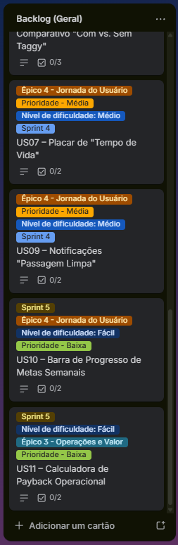

# Projeto Taggy

O _Taggy_ é uma solução de pagamento automático (Tag) que vai além da conveniência. Nosso objetivo é transformar cada passagem por pedágios e estacionamentos em dados acionáveis de sustentabilidade (ESG), economia de combustível e eficiência operacional.

---

## Visão Geral

O sistema utiliza a inteligência de dados para calcular o impacto ambiental positivo gerado pela fluidez no trânsito. Focamos em três pilares:

1. _Inteligência:_ Cálculos baseados no GHG Protocol para CO₂ e economia de diesel.
2. _Engajamento:_ Linguagem lúdica para aproximar o usuário da causa ambiental.
3. _Gestão:_ Dashboards robustos para frotas que buscam certificados ESG.

## Público-Alvo (Personas)

- _Mariana Costa (Sustentabilidade):_ Precisa de dados auditáveis para relatórios anuais.
- _Ricardo Almeida (Operações):_ Focado em redução de custos de combustível e manutenção.
- _Tiago Mendes (Motorista):_ Valoriza praticidade, status e o "tempo ganho".
- _Jéssica Castro (Product Lead):_ Busca métricas de engajamento e diferenciais competitivos.

## Estrutura do Projeto

O projeto está dividido em 5 pilares estratégicos:

- _Pilar 1:_ O Cálculo (Inteligência de Dados)
- _Pilar 2:_ Os Painéis (Visualização)
- _Pilar 3:_ Incentivos e Avisos (Gamificação)
- _Pilar 4:_ Conexão e Linguagem (UX Writing)
- _Pilar 5:_ Vantagens de Negócio (Certificações)

---

## User Stories

Versão detalhada (Card, Conversation e Confirmation): [docs/user-stories.md](docs/user-stories.md).

### 🔴 Prioridade Alta: Fundação e entregas core

- _[US01] Configuração do repositório:_ Boilerplate front/back, qualidade de código e documentação mínima para onboarding.
- _[US02] Tradução Lúdica de Impacto:_ Metáforas visuais para impacto ambiental (carbono, água, papel).
- _[US03] Conversor de Combustível em Carbono:_ Cálculo ESG com GHG Protocol (leve flex / pesado diesel) e auditoria.
- _[US04] Cálculo de Economia de Papel Térmico:_ Papel (BPA) evitado, água poupada e árvores preservadas no dashboard.
- _[US05] Dashboard Comparativo "Com vs. Sem Taggy":_ ROI com delta em R$ e litros e filtros por veículo, placa ou período.
- _[US06] Gestão de Inventário de Frota:_ Cadastro de veículos e Tags com validações, lote (CSV/Excel) e CRUD.

### 🟡 Prioridade Média: Rotina e Experiência

- _[US07] Placar de "Tempo de Vida":_ Horas/dias ganhos com atualização após cada transação confirmada.
- _[US08] Roteirizador de Fluxo Sustentável:_ Rotas verdes no mapa e estimativa de CO₂ evitado antes do trajeto.
- _[US09] Notificações "Passagem Limpa":_ Push rápido com economia de combustível e CO₂ da passagem.

### 🟢 Prioridade Baixa: Diferenciais e Negócio

- _[US10] Barra de Progresso de Metas Semanais:_ Metas semanais configuráveis por frota ou perfil.
- _[US11] Calculadora de Payback Operacional:_ Saldo real (economia − mensalidade) e status "Tag Paga".

---

## Backlog (Trello)

O backlog do projeto está organizado no quadro da equipe na disciplina, com cartões alinhados às user stories e prioridades. Acompanhe o estado das tarefas em: [Trello – cesar-projetos-2](https://trello.com/b/alfFb7dV/cesar-projetos-2).

## Evidências

Capturas de tela solicitadas para comprovar o backlog e a organização do trabalho no Trello. Os arquivos originais ficam em [`docs/images/`](docs/images/). No GitHub (e na maioria dos previews de Markdown), as figuras abaixo aparecem **embutidas** no README — basta que `docs/images/*.png` esteja versionado no repositório.

_Backlog no Trello:_

<table>
  <tr>
    <td align="center" valign="top" width="33%">
      
    </td>
    <td align="center" valign="top" width="33%">
      
    </td>
    <td align="center" valign="top" width="33%">
      
    </td>
  </tr>
</table>

---

## Equipe e Papéis

| Nome              | Papel                   | E-mail             |
| :---------------- | :---------------------- | :----------------- |
| _Afonso Araujo_   | Desenvolvedor Back-End  | ahma@cesar.school  |
| _Igor Phillipe_   | Desenvolvedor FullStack | ipara@cesar.school |
| _Williams Pontes_ | Product Owner           | jwlp@cesar.school  |
| _Jean Augusto_    | Desenvolvedor Back-End  | jasm2@cesar.school |
| _Lucas Gabriel_   | Desenvolvedor FullStack | lgcs2@cesar.school |
| _Kellwen Costa_   | Desenvolvedor Back-End  | kilc@cesar.school  |

---

Este projeto faz parte da disciplina de SI010 - Fundamentos de Desenvolvimento de Software.
