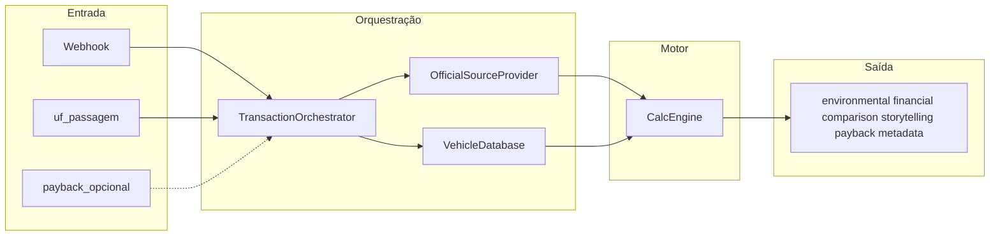

# Motor de cálculo (CalcEngine) — especificação e código de referência

Este documento descreve o **motor de impacto por passagem** usado pelo produto Taggy (pedágio / estacionamento): estimativa de CO₂e evitado, água e papel poupadas, valor em R$, metáforas para UI (US02), comparação **com vs. sem tag** (US05) e **payback** opcional (US11). O texto alinha-se às premissas do desafio em [Premissas do desafio](../negocio/premissas-desafio.md) e às user stories em [user-stories.md](../produto/user-stories.md).

**Objetivo:** dado um evento de passagem (tempo observado, contexto, veículo), produzir um **payload JSON** para dashboard, relatórios ESG e notificações.

**Fora de âmbito deste motor:** roteirização e mapas (US08), metas semanais (US10), agregação temporal completa na base de dados (a app soma passagens e chama payback com acumulados).

### Fontes de dados

- **Preços de combustível (por UF):** série ANP disponível em BigQuery via Base dos Dados — dataset [`basedosdados.br_anp_precos_combustiveis`](https://console.cloud.google.com/bigquery?p=basedosdados&d=br_anp_precos_combustiveis). O sync materializa preços na aplicação; o detalhe de query e credenciais GCP fica fora deste documento.
- **Dados do veículo por placa:** API Senatran/Serpro — [`consultarVeiculoPorPlaca`](https://wsdenatran.estaleiro.serpro.gov.br/v1/api-doc/#/Consulta%20de%20Ve%C3%ADculos/consultarVeiculoPorPlaca) (ambiente estaleiro). Autenticação e limites seguem a documentação oficial.

---

## 1. Conclusão da revisão: faz sentido para o que desenvolvemos?

O desenho cobre o **núcleo ESG + valor financeiro + orquestração** de evento. É um **modelo simplificado e transparente por transação**, adequado a MVP; constantes devem ser **versionadas** e inputs **logados** para auditoria (sensibilidade e planilha replicável são complementares, conforme [Premissas do desafio](../negocio/premissas-desafio.md)).

| Área | Cobertura | Notas |
|------|-----------|--------|
| US03 Combustível → CO₂e | Forte | Fatores por combustível, marcha lenta e surto de aceleração por categoria. |
| US04 Papel / água | Forte | Ticket térmico evitado → CO₂ e litros de água (proxy do ciclo de vida). |
| US02 Metáforas lúdicas | Forte | `ludic_metaphors` com **≥3** metáforas por eixo (água, papel, carbono), todas em `specs`. |
| US05 Com vs. sem tag | Forte | Objeto `comparison` + desgaste de parada (`brake_wear_brl`) + combustível repartido (idle / aceleração). |
| US06 Frota | Forte | `VehicleDatabase` (interno + API + fallback). |
| US07 Tempo de vida | Apoio | `metadata.time_saved_sec` para agregar horas/dias na app. |
| US09 Notificações | Apoio | Payload com `storytelling` por eixo e totais por passagem. |
| US11 Payback | Coberto | `payback` opcional com mensalidade e acumulado (cálculo na app ou pass-through). |
| US08 / US10 | Fora do motor | Não incluídos aqui. |

**Riscos e premissas (documentar sempre):**

- **`calculate_avoided_acceleration_fuel`** devolve um volume **fixo por passagem** (um ciclo “parar na cabine + arrancar” evitado), **independente** do tempo poupado na fila — coerente com “um evento de surto evitado”, mas pode superestimar se a passagem for anómala.
- **`is_digital`** deve ser parâmetro quando houver ticket físico em estacionamento.
- **`convert_from_co2`** usa `benchmarks` em `specs` (evitar “números mágicos” no código).

---

## 2. Mapeamento rápido US → artefactos

| US | Onde aparece no motor |
|----|------------------------|
| US02 | `get_ludic_metrics_by_axis`, chave `storytelling.by_axis`, `specs['ludic_metaphors']`. |
| US03 | `calculate_emissions_from_fuel`, `emission_factors`, `idle_rates`, `accel_surge`. |
| US04 | `calculate_paper_and_water_savings`, `paper_impact`. |
| US05 | `financial` (idle/accel/freio), `comparison.without_tag` / `with_tag`. |
| US06 | `VehicleDatabase.get_complete_vehicle_data`. |
| US07 | `metadata.time_saved_sec`. |
| US09 | Somatório ambiental + `storytelling` por passagem. |
| US11 | `calculate_payback_snapshot`, chave opcional `payback` no retorno. |
| Preços / auditoria | Webhook `uf_passagem`; `metadata.pricing_snapshot` + persistência na passagem. |

---

## 3. Fluxo de dados

1. O **webhook** entrega tempo de passagem, placa, **UF da passagem** (`uf_passagem`, ex. onde está a praça ou o estacionamento) e contexto (`pedagio` / `estacionamento`).
2. O **orquestrador** resolve veículo (`VehicleDatabase` → API Senatran quando necessário), injeta `specs` atuais (`OfficialSourceProvider`, preços já agregados por UF a partir do BigQuery) e chama `CalcEngine.process_transaction` com `uf_passagem`.
3. A **engine** resolve o **preço por litro** para aquela UF e tipo de combustível, calcula R$, devolve **`metadata.pricing_snapshot`** (valor usado naquele momento) e o restante do payload; opcionalmente **payback** se o caller enviar acumulado + mensalidade.



---

## 4. Dicionário de `technical_specs` (e `get_all_specs`)

Todas as chaves abaixo entram no dicionário injetado em `CalcEngine.specs`. Unidades e uso:

| Chave | Significado | Unidades / formato | Consumido em |
|-------|-------------|-------------------|----------------|
| `emission_factors` | Fator CO₂e por litro (combustível) | kg CO₂e / L | `calculate_emissions_from_fuel` |
| `idle_rates` | Consumo em marcha lenta | L / s | `calculate_avoided_idle_fuel`, `comparison` |
| `accel_surge` | Litro extra de um surto “cabine” evitado | L por passagem, por categoria | `calculate_avoided_acceleration_fuel`, `comparison` |
| `paper_impact` | `co2_per_ticket`, `water_per_ticket` | kg CO₂e/ticket; L/ticket | US04, `convert_to_co2` |
| `ludic_factors` | Legado: árvore/telefone/café numéricos | ver defaults | `get_ludic_metrics` (retrocompat.) |
| `ludic_metaphors` | Listas por eixo `carbon`, `water`, `paper` | ver sub-tabela | `get_ludic_metrics_by_axis` |
| `baselines` | `avg_wait_sec` por `context` | s | `process_transaction`, `comparison` |
| `fuel_prices_by_uf` | Preço por litro **por estado** e por `fuel_type` | `Dict[UF, Dict[fuel_type, R$/L]]` (UF = sigla, ex. `SP`) | `resolve_fuel_price_brl_per_liter`, `calculate_financial_savings` |
| `fuel_prices_meta` | Metadados da última sincronização a partir do BigQuery | ex.: `as_of` (ISO), `aggregation` (ex. `median_by_uf_last_week`), `source`, opcional `default_uf` para fallback | cópia parcial em `metadata.pricing_snapshot` |
| `fuel_prices` | *(Opcional / legado)* Preço nacional ou fallback único por `fuel_type` | R$ / L | usado só se a UF pedida não existir em `fuel_prices_by_uf` |
| `maint_costs` | Outros micro-ganhos de manutenção genérica | R$ / passagem (por categoria) | `calculate_financial_savings` |
| `brake_cost_per_stop_brl` | Custo atribuído a **uma parada tipo cabine** (freio + desgaste associado) | R$ / parada, por categoria | `brake_wear_brl` (US05) |
| `benchmarks` | Equivalências para `convert_from_co2` | kg CO₂e por unidade | `convert_from_co2` |

**Formato de `ludic_metaphors` (US02):** cada eixo é uma lista com **pelo menos três** entradas. Campos:

- **Eixo `carbon`:** `id`, `label`, `kg_co2_per_unit` — valor mostrado = `total_co2_kg / kg_co2_per_unit` (ex.: kg por árvore-ano).
- **Eixo `water`:** `id`, `label`, `liters_per_unit` — valor = `water_liters / liters_per_unit` (ex.: litros por “chuveiro”).
- **Eixo `paper`:** `id`, `label`, `tickets_per_unit` — valor = `paper_tickets / tickets_per_unit` (ex.: tickets por resma).

Os `label` são texto fixo para demo; em produção podem ser chaves i18n.

**`metadata.pricing_snapshot` (contrato mínimo):** objeto devolvido em cada `process_transaction` para auditoria e gravação na passagem — `fuel_price_brl_per_liter`, `fuel_type_applied`, `uf_applied` (UF cujo preço foi usado, pode diferir da pedida em fallback), `currency` (`BRL`), `price_as_of` (ISO, espelha `fuel_prices_meta.as_of` quando existir), `price_source` (ex. `basedosdados:br_anp_precos_combustiveis`). Ao persistir a passagem, grave este objeto tal como retornado (JSONB ou colunas espelhadas).

---

## 5. Payback (US11) — uma passagem vs. período

- **Por passagem:** o motor devolve apenas a **economia desta passagem** em `financial.total_savings_brl` (e componentes). O payback “real” exige a **app** somar `total_savings_brl` no mês e chamar `calculate_payback_snapshot(accumulated_savings_brl, monthly_tag_fee_brl, billing_months)` ou passar `payback` em `process_transaction`.
- **Fórmula:** `net_brl = accumulated_savings_brl - monthly_tag_fee_brl * billing_months`. Se `net_brl >= 0`, `status = "tag_paga"`; caso contrário `"em_payback"`.
- **Premissa:** `monthly_tag_fee_brl` é por **conta ou veículo** — o produto deve documentar qual; o motor só aplica a fórmula.

---

## 6. Código de referência (Python)

Acrescente os blocos **em ordem** ao mesmo ficheiro (ex.: `engine.py`): **1 → 2 → 3 → 4**. O **Bloco 1** contém imports partilhados da `CalcEngine`.

### Bloco 1 — `CalcEngine`

```python
from __future__ import annotations

from typing import Any, Dict, List, Optional


class CalcEngine:
    def __init__(self, technical_specs: Dict[str, Any]):
        """
        technical_specs: ver dicionário na secção 4 deste documento.
        """
        self.specs = technical_specs

    # --- Conversão universal ---

    def convert_to_co2(self, value: float, unit: str) -> float:
        """
        Converte unidades de entrada para kg CO2e (pivot).
        unit: 'water_liters', 'paper_tickets', 'fuel_liters_<tipo>'.
        """
        if unit == "water_liters":
            tickets = value / self.specs["paper_impact"]["water_per_ticket"]
            return tickets * self.specs["paper_impact"]["co2_per_ticket"]
        if unit == "paper_tickets":
            return value * self.specs["paper_impact"]["co2_per_ticket"]
        if unit.startswith("fuel_liters_"):
            fuel_type = unit.replace("fuel_liters_", "")
            return self.calculate_emissions_from_fuel(value, fuel_type)
        return 0.0

    def convert_from_co2(self, co2_kg: float, target_unit: str) -> float:
        """Converte kg CO2e para unidade simbólica usando specs['benchmarks'] e paper_impact."""
        bench = self.specs.get("benchmarks", {})
        factors = self.specs["ludic_factors"]
        mapping = {
            "trees": co2_kg / factors["tree_year_absorption"],
            "water": (co2_kg / self.specs["paper_impact"]["co2_per_ticket"])
            * self.specs["paper_impact"]["water_per_ticket"],
            "smartphone": co2_kg * factors["phone_charge_factor"],
            "km_driven": co2_kg / bench.get("kg_co2_per_km_car", 0.12),
            "burgers": co2_kg / bench.get("kg_co2_per_burger", 2.5),
        }
        return mapping.get(target_unit, 0.0)

    # --- Ambiental (US03, US04) ---

    def calculate_emissions_from_fuel(self, liters: float, fuel_type: str) -> float:
        """Litros economizados × fator kg CO2e/L (GHG / inventário)."""
        factor = self.specs["emission_factors"].get(fuel_type, 2.15)
        return liters * factor

    def calculate_avoided_idle_fuel(self, time_saved_sec: int, category: str) -> float:
        """Litros não queimados em marcha lenta durante o tempo poupado na fila."""
        rates = self.specs["idle_rates"]
        rate = rates.get(category, rates["leve"])
        return time_saved_sec * rate

    def calculate_avoided_acceleration_fuel(self, category: str) -> float:
        """Litros do surto de aceleração pós-parada evitados (fixo por passagem)."""
        return float(self.specs["accel_surge"].get(category, 0.015))

    def calculate_paper_and_water_savings(self, is_digital: bool) -> Dict[str, float]:
        """US04: um ticket evitado por passagem digital."""
        if not is_digital:
            return {"co2": 0.0, "water": 0.0, "paper_tickets": 0.0}
        pi = self.specs["paper_impact"]
        return {
            "co2": pi["co2_per_ticket"],
            "water": pi["water_per_ticket"],
            "paper_tickets": 1.0,
        }

    # --- Financeiro (US05) ---

    def resolve_fuel_price_brl_per_liter(self, uf_passagem: str, fuel_type: str) -> tuple[float, str]:
        """
        Preço R$/L para o tipo de combustível na UF da passagem.
        Ordem: UF pedida em fuel_prices_by_uf → default_uf em fuel_prices_meta → legado fuel_prices (ex. BR) → constante 5.80.
        Retorna (preço, uf_aplicada) para o snapshot.
        """
        by_uf: Dict[str, Any] = self.specs.get("fuel_prices_by_uf") or {}
        meta: Dict[str, Any] = self.specs.get("fuel_prices_meta") or {}
        uf = (uf_passagem or "").strip().upper() or str(meta.get("default_uf", "SP"))
        row = by_uf.get(uf) or {}
        if fuel_type in row:
            return float(row[fuel_type]), uf
        def_uf = str(meta.get("default_uf", "SP")).strip().upper()
        row_d = by_uf.get(def_uf) or {}
        if fuel_type in row_d:
            return float(row_d[fuel_type]), def_uf
        legacy = self.specs.get("fuel_prices") or {}
        if fuel_type in legacy:
            return float(legacy[fuel_type]), "BR"
        return 5.80, uf

    def calculate_financial_savings(
        self,
        idle_liters: float,
        accel_liters: float,
        fuel_type: str,
        category: str,
        fuel_price_brl_per_liter: float,
        stops_avoided: int = 1,
    ) -> Dict[str, Any]:
        """
        Decompõe economia em marcha lenta vs. surto; freios por parada evitada; manutenção genérica.
        fuel_price_brl_per_liter: valor já resolvido (UF + tipo) para este cálculo — deve coincidir com metadata.pricing_snapshot.
        """
        price = float(fuel_price_brl_per_liter)
        idle_brl = round(idle_liters * price, 2)
        accel_brl = round(accel_liters * price, 2)
        brake_map = self.specs.get("brake_cost_per_stop_brl", {"leve": 0.15, "pesado": 0.45})
        per_stop = float(brake_map.get(category, brake_map.get("leve", 0.15)))
        brake_brl = round(per_stop * stops_avoided, 2)
        maint = float(self.specs["maint_costs"].get(category, self.specs["maint_costs"]["leve"]))
        fuel_total_brl = round(idle_brl + accel_brl, 2)
        total = round(fuel_total_brl + brake_brl + maint, 2)
        return {
            "fuel_savings_idle_brl": idle_brl,
            "fuel_savings_accel_brl": accel_brl,
            "fuel_savings_brl": fuel_total_brl,
            "brake_wear_brl": brake_brl,
            "maintenance_savings_brl": maint,
            "total_savings_brl": total,
        }

    def build_comparison(
        self,
        baseline_time_sec: int,
        real_time_sec: int,
        vehicle_data: Dict[str, Any],
        is_digital: bool,
        fuel_price_brl_per_liter: float,
    ) -> Dict[str, Any]:
        """US05: cenário sem tag (espera plena + surto) vs. com tag (tempo real + sem surto). Mesmo preço/litro nos dois ramos."""
        cat = vehicle_data["category"]
        fuel_type = vehicle_data["fuel_type"]
        rate = self.specs["idle_rates"].get(cat, self.specs["idle_rates"]["leve"])
        accel = float(self.specs["accel_surge"].get(cat, 0.015))

        without_idle = baseline_time_sec * rate
        without_total = without_idle + accel

        with_idle = max(0, real_time_sec) * rate
        with_total = with_idle  # passagem fluida: sem segundo surto de cabine

        paper_without = self.calculate_paper_and_water_savings(is_digital=False)
        paper_with = self.calculate_paper_and_water_savings(is_digital=is_digital)

        co2_without = self.calculate_emissions_from_fuel(without_total, fuel_type) + paper_without["co2"]
        co2_with = self.calculate_emissions_from_fuel(with_total, fuel_type) + paper_with["co2"]

        stops_without = 1
        stops_with = 0 if is_digital else 1

        # Financeiro alinhado aos litros e paradas de cada cenário
        fin_without = self.calculate_financial_savings(
            idle_liters=without_idle,
            accel_liters=accel,
            fuel_type=fuel_type,
            category=cat,
            fuel_price_brl_per_liter=fuel_price_brl_per_liter,
            stops_avoided=stops_without,
        )
        fin_with = self.calculate_financial_savings(
            idle_liters=with_idle,
            accel_liters=0.0,
            fuel_type=fuel_type,
            category=cat,
            fuel_price_brl_per_liter=fuel_price_brl_per_liter,
            stops_avoided=stops_with,
        )

        return {
            "without_tag": {
                "time_sec": baseline_time_sec,
                "fuel_liters": round(without_total, 4),
                "co2_kg": round(co2_without, 4),
                "water_liters": paper_without["water"],
                "estimated_brl": fin_without["total_savings_brl"],
            },
            "with_tag": {
                "time_sec": real_time_sec,
                "fuel_liters": round(with_total, 4),
                "co2_kg": round(co2_with, 4),
                "water_liters": paper_with["water"],
                "estimated_brl": fin_with["total_savings_brl"],
            },
            "delta": {
                "fuel_liters": round(without_total - with_total, 4),
                "co2_kg": round(co2_without - co2_with, 4),
                "water_liters": round(paper_with["water"] - paper_without["water"], 4),
                "estimated_brl": round(
                    fin_without["total_savings_brl"] - fin_with["total_savings_brl"], 2
                ),
            },
        }

    # --- Storytelling (US02) ---

    def get_ludic_metrics(self, total_co2_avoided: float) -> Dict[str, Any]:
        """Retrocompatível: métricas únicas a partir de ludic_factors."""
        factors = self.specs["ludic_factors"]
        return {
            "trees_saved": round(total_co2_avoided / factors["tree_year_absorption"], 2),
            "smartphone_charges": int(total_co2_avoided * factors["phone_charge_factor"]),
            "coffee_filters": int(total_co2_avoided * factors["coffee_factor"]),
        }

    def get_ludic_metrics_by_axis(
        self,
        total_co2_kg: float,
        water_liters: float,
        paper_tickets: float,
    ) -> Dict[str, List[Dict[str, Any]]]:
        """
        US02: ≥3 metáforas por eixo, todas definidas em specs['ludic_metaphors'].
        """
        raw = self.specs.get("ludic_metaphors", _default_ludic_metaphors())
        out: Dict[str, List[Dict[str, Any]]] = {"carbon": [], "water": [], "paper": []}
        for m in raw.get("carbon", []):
            kg = float(m["kg_co2_per_unit"])
            out["carbon"].append(
                {
                    "id": m["id"],
                    "label": m["label"],
                    "value": round(total_co2_kg / kg, 4) if kg else 0.0,
                }
            )
        for m in raw.get("water", []):
            lu = float(m["liters_per_unit"])
            out["water"].append(
                {
                    "id": m["id"],
                    "label": m["label"],
                    "value": round(water_liters / lu, 4) if lu else 0.0,
                }
            )
        for m in raw.get("paper", []):
            tu = float(m["tickets_per_unit"])
            out["paper"].append(
                {
                    "id": m["id"],
                    "label": m["label"],
                    "value": round(paper_tickets / tu, 4) if tu else 0.0,
                }
            )
        return out

    # --- Payback (US11) ---

    @staticmethod
    def calculate_payback_snapshot(
        accumulated_savings_brl: float,
        monthly_tag_fee_brl: float,
        billing_months: float = 1.0,
    ) -> Dict[str, Any]:
        fees = monthly_tag_fee_brl * billing_months
        net = round(accumulated_savings_brl - fees, 2)
        return {
            "accumulated_savings_brl": round(accumulated_savings_brl, 2),
            "monthly_tag_fee_brl": monthly_tag_fee_brl,
            "billing_months": billing_months,
            "fees_total_brl": round(fees, 2),
            "net_brl": net,
            "status": "tag_paga" if net >= 0 else "em_payback",
        }

    def process_transaction(
        self,
        real_time_sec: int,
        vehicle_data: Dict[str, Any],
        context: str,
        uf_passagem: str,
        *,
        is_digital: bool = True,
        payback: Optional[Dict[str, Any]] = None,
    ) -> Dict[str, Any]:
        """
        Gera o payload principal.
        uf_passagem: sigla UF onde ocorreu a passagem (praça / estacionamento).
        payback: opcional com monthly_tag_fee_brl, accumulated_savings_brl, billing_months (default 1).
        """
        baseline_time = int(self.specs["baselines"][context]["avg_wait_sec"])
        time_saved = max(0, baseline_time - real_time_sec)

        idle_liters = self.calculate_avoided_idle_fuel(time_saved, vehicle_data["category"])
        accel_liters = self.calculate_avoided_acceleration_fuel(vehicle_data["category"])
        total_liters_saved = idle_liters + accel_liters

        paper_water = self.calculate_paper_and_water_savings(is_digital)
        fuel_co2 = self.calculate_emissions_from_fuel(total_liters_saved, vehicle_data["fuel_type"])
        total_co2_avoided = fuel_co2 + paper_water["co2"]

        fuel_type = vehicle_data["fuel_type"]
        price_per_l, uf_applied = self.resolve_fuel_price_brl_per_liter(uf_passagem, fuel_type)
        meta = self.specs.get("fuel_prices_meta") or {}
        pricing_snapshot = {
            "fuel_price_brl_per_liter": round(price_per_l, 4),
            "fuel_type_applied": fuel_type,
            "uf_applied": uf_applied,
            "currency": "BRL",
            "price_as_of": meta.get("as_of", ""),
            "price_source": meta.get("source", "basedosdados:br_anp_precos_combustiveis"),
        }

        stops_avoided = 1  # uma parada tipo cabine evitada nesta passagem com tag

        financial = self.calculate_financial_savings(
            idle_liters,
            accel_liters,
            fuel_type,
            vehicle_data["category"],
            fuel_price_brl_per_liter=price_per_l,
            stops_avoided=stops_avoided,
        )

        comparison = self.build_comparison(
            baseline_time_sec=baseline_time,
            real_time_sec=real_time_sec,
            vehicle_data=vehicle_data,
            is_digital=is_digital,
            fuel_price_brl_per_liter=price_per_l,
        )

        storytelling = {
            "legacy": self.get_ludic_metrics(total_co2_avoided),
            "by_axis": self.get_ludic_metrics_by_axis(
                total_co2_avoided,
                paper_water["water"],
                paper_water["paper_tickets"],
            ),
        }

        payload: Dict[str, Any] = {
            "environmental": {
                "co2_kg": round(total_co2_avoided, 4),
                "water_liters": paper_water["water"],
                "fuel_liters": round(total_liters_saved, 4),
                "paper_tickets": paper_water["paper_tickets"],
            },
            "financial": financial,
            "comparison": comparison,
            "storytelling": storytelling,
            "metadata": {
                "time_saved_sec": time_saved,
                "baseline_wait_sec": baseline_time,
                "context": context,
                "is_digital": is_digital,
                "uf_passagem": (uf_passagem or "").strip().upper(),
                "pricing_snapshot": pricing_snapshot,
            },
        }

        if payback is not None:
            acc = float(payback["accumulated_savings_brl"])
            monthly = float(payback["monthly_tag_fee_brl"])
            months = float(payback.get("billing_months", 1.0))
            payload["payback"] = self.calculate_payback_snapshot(acc, monthly, months)

        return payload


def _default_ludic_metaphors() -> Dict[str, List[Dict[str, Any]]]:
    """Valores ilustrativos; substituir por dados revisados e versionados."""
    return {
        "carbon": [
            {"id": "tree_year", "label": "Árvores (absorção ~1 ano)", "kg_co2_per_unit": 15.0},
            {"id": "burger", "label": "Hambúrgueres (pegada média)", "kg_co2_per_unit": 2.5},
            {"id": "km_car", "label": "Km carro médio (120 g/km)", "kg_co2_per_unit": 0.12},
        ],
        "water": [
            {"id": "shower_8min", "label": "Chuveiros (~8 min)", "liters_per_unit": 60.0},
            {"id": "drinking_day", "label": "Dias de consumo humano (2 L/dia)", "liters_per_unit": 2.0},
            {"id": "flush", "label": "Descargas de sanita (~6 L)", "liters_per_unit": 6.0},
        ],
        "paper": [
            {"id": "ream_a4", "label": "Resmas A4 (~500 folhas)", "tickets_per_unit": 500.0},
            {"id": "notebook", "label": "Cadernos escolares (~50 folhas)", "tickets_per_unit": 50.0},
            {"id": "toilet_roll", "label": "Rolos de papel higiénico (~equivalente folhas)", "tickets_per_unit": 150.0},
        ],
    }
```

### Bloco 2 — `VehicleDatabase`

```python
from typing import Any, Dict

import requests

# API Senatran / Serpro — consulta veículo por placa (path conforme OpenAPI publicado).
SENATRAN_API_BASE = "https://wsdenatran.estaleiro.serpro.gov.br/v1"


class VehicleDatabase:
    """
    US06: frota interna (BD) + API externa Senatran + perfil genérico.

    Contrato get_complete_vehicle_data(plate: str) -> VehicleInternal:
        plate: placa Mercosul ou antiga normalizada pela app.
        Retorno mínimo (chaves estáveis para a CalcEngine):
            plate: str
            category: "leve" | "pesado"
            fuel_type: "diesel_s10" | "gasolina_c" | "etanol"  # alinhar ao catálogo da engine
            model: str
        Campos opcionais sugeridos para persistência / UI (preencher quando a API devolver):
            ano_fabricacao, ano_modelo, renavam, chassi, cor, uf_licenciamento, capacidade_maxima_tracao, ...
    """

    def __init__(self, db_connection: Any, api_credentials: Any):
        self.db = db_connection
        self.api_credentials = api_credentials  # token / certificado conforme contrato Serpro

    def get_complete_vehicle_data(self, plate: str) -> Dict[str, Any]:
        local_data = self.db.find_vehicle_by_plate(plate)
        if local_data:
            return local_data

        # GET .../consultarVeiculoPorPlaca?placa= — ajustar path e query ao OpenAPI oficial.
        url = f"{SENATRAN_API_BASE}/consultarVeiculoPorPlaca"
        try:
            response = requests.get(
                url,
                params={"placa": plate.replace("-", "").upper()},
                headers={},  # TODO: Authorization / headers exigidos pelo estaleiro Serpro
                timeout=20,
            )
            if response.status_code == 200:
                raw = response.json()
                processed = self._map_external_to_internal(plate, raw)
                self.db.save_vehicle(processed)
                return processed
        except OSError as e:
            print(f"Falha na consulta Senatran: {e}")

        return {"plate": plate, "category": "leve", "fuel_type": "gasolina_c", "model": "Desconhecido"}

    def _map_external_to_internal(self, plate: str, raw: Dict[str, Any]) -> Dict[str, Any]:
        """
        Mapeamento JSON Senatran -> VehicleInternal.
        TODO: alinhar nomes exatos aos campos do schema OpenAPI (ex.: peso para categoria, campo de combustível).
        """
        pbt = raw.get("peso_bruto_total", raw.get("pesoBrutoTotal", 0))
        fuel = str(raw.get("combustivel", raw.get("tipoCombustivel", ""))).lower()
        model = raw.get("modelo_versao", raw.get("modelo", "Modelo Indefinido"))
        return {
            "plate": plate,
            "category": "pesado" if float(pbt or 0) > 3500 else "leve",
            "fuel_type": "diesel_s10" if "diesel" in fuel else "gasolina_c",
            "model": model,
        }
```

### Bloco 3 — `OfficialSourceProvider` e `_fallback_technical_specs`

```python
from typing import Any, Dict

# Fonte de preços: tabela pública Base dos Dados no BigQuery (agregação por UF feita no sync).
FUEL_PRICES_BQ_TABLE = "basedosdados.br_anp_precos_combustiveis"


def _fallback_technical_specs() -> Dict[str, Any]:
    """Primeira execução ou BD vazio; inclui chaves US02/US05/US11 + preços por UF."""
    return {
        "emission_factors": {"diesel_s10": 2.51, "gasolina_c": 2.15, "etanol": 0.44},
        "idle_rates": {"leve": 0.00027, "pesado": 0.00069},
        "paper_impact": {"co2_per_ticket": 0.012, "water_per_ticket": 0.5},
        "ludic_factors": {
            "tree_year_absorption": 15.0,
            "phone_charge_factor": 120.0,
            "coffee_factor": 10.0,
        },
        "ludic_metaphors": {
            "carbon": [
                {"id": "tree_year", "label": "Árvores (absorção ~1 ano)", "kg_co2_per_unit": 15.0},
                {"id": "burger", "label": "Hambúrgueres (pegada média)", "kg_co2_per_unit": 2.5},
                {"id": "km_car", "label": "Km carro médio (120 g/km)", "kg_co2_per_unit": 0.12},
            ],
            "water": [
                {"id": "shower_8min", "label": "Chuveiros (~8 min)", "liters_per_unit": 60.0},
                {"id": "drinking_day", "label": "Dias de consumo humano (2 L/dia)", "liters_per_unit": 2.0},
                {"id": "flush", "label": "Descargas de sanita (~6 L)", "liters_per_unit": 6.0},
            ],
            "paper": [
                {"id": "ream_a4", "label": "Resmas A4 (~500 folhas)", "tickets_per_unit": 500.0},
                {"id": "notebook", "label": "Cadernos escolares (~50 folhas)", "tickets_per_unit": 50.0},
                {"id": "toilet_roll", "label": "Rolos papel higiénico (~equiv. folhas)", "tickets_per_unit": 150.0},
            ],
        },
        "baselines": {
            "pedagio": {"avg_wait_sec": 300},
            "estacionamento": {"avg_wait_sec": 180},
        },
        "fuel_prices_by_uf": {
            "SP": {"diesel_s10": 6.10, "gasolina_c": 5.85, "etanol": 3.60},
            "RJ": {"diesel_s10": 6.12, "gasolina_c": 5.88, "etanol": 3.55},
        },
        "fuel_prices_meta": {
            "as_of": "2026-04-01",
            "aggregation": "median_by_uf_last_week",
            "source": "basedosdados:br_anp_precos_combustiveis",
            "default_uf": "SP",
        },
        "fuel_prices": {"diesel_s10": 6.10, "gasolina_c": 5.85, "etanol": 3.60},
        "maint_costs": {"leve": 0.05, "pesado": 0.25},
        "brake_cost_per_stop_brl": {"leve": 0.15, "pesado": 0.45},
        "accel_surge": {"leve": 0.015, "pesado": 0.080},
        "benchmarks": {"kg_co2_per_km_car": 0.12, "kg_co2_per_burger": 2.5},
    }


class OfficialSourceProvider:
    """
    Fornece technical_specs à CalcEngine.
    Preços: materializados a partir de consultas ao BigQuery sobre FUEL_PRICES_BQ_TABLE (job agendado).
    """

    def __init__(self, db: Any):
        self.db = db

    def sync_all_sources(self) -> None:
        self._sync_fuel_prices_from_bq()
        self._sync_ghg_factors_mcti()

    def _sync_fuel_prices_from_bq(self) -> None:
        """
        Popula self.db com fuel_prices_by_uf + fuel_prices_meta a partir de FUEL_PRICES_BQ_TABLE.
        Stub: implementar cliente BigQuery + SQL de agregação por UF na camada de dados.
        """
        pass

    def _sync_ghg_factors_mcti(self) -> None:
        """Placeholder para fatores oficiais MCTI / GHG Protocol."""
        pass

    def get_all_specs(self) -> Dict[str, Any]:
        specs = self.db.get_current_technical_specs()
        if specs:
            return specs
        return _fallback_technical_specs()
```

### Bloco 4 — `TransactionOrchestrator`

```python
from __future__ import annotations

from typing import Any, Dict, Optional


class TransactionOrchestrator:
    """Coordena webhook → veículo → specs → CalcEngine."""

    def __init__(self, engine: CalcEngine, vehicle_db: VehicleDatabase, sources: OfficialSourceProvider):
        self.engine = engine
        self.v_db = vehicle_db
        self.sources = sources

    def handle_tag_event(self, webhook_payload: Dict[str, Any]) -> Dict[str, Any]:
        vehicle_data = self.v_db.get_complete_vehicle_data(webhook_payload["plate"])
        context = webhook_payload.get("context", "pedagio")
        self.engine.specs = self.sources.get_all_specs()

        payback: Optional[Dict[str, Any]] = webhook_payload.get("payback")

        uf_passagem = str(webhook_payload.get("uf_passagem") or webhook_payload.get("uf") or "")

        return self.engine.process_transaction(
            real_time_sec=int(webhook_payload["elapsed_time"]),
            vehicle_data=vehicle_data,
            context=context,
            uf_passagem=uf_passagem,
            is_digital=bool(webhook_payload.get("is_digital", True)),
            payback=payback,
        )
```

---

## 7. Limitações

- **Senatran / Serpro:** path, headers e corpo exatos da operação `consultarVeiculoPorPlaca` devem seguir o OpenAPI do estaleiro; o mapeamento `_map_external_to_internal` deve ser atualizado quando o schema for fixado.
- **BigQuery:** credenciais GCP, agregação por UF e colunas da tabela `br_anp_precos_combustiveis` ficam na implementação do `_sync_fuel_prices_from_bq`, não neste documento.
- **Agregação mensal** e histórico de payback ficam na **camada de serviço ou app**; o motor expõe `calculate_payback_snapshot` e o payload opcional.
- **`build_comparison`:** o ramo financeiro usa o mesmo `fuel_price_brl_per_liter` que a passagem; valores são **estimativas** dependentes de `baselines` e `brake_cost_per_stop_brl`.

---

## 8. Pseudofluxo payback na app

1. A cada passagem, somar `payload["financial"]["total_savings_brl"]` ao acumulado do veículo/mês.
2. No fim do ciclo de faturação, chamar `CalcEngine.calculate_payback_snapshot(acc, monthly_fee, billing_months=1)`.
3. Expor na UI o `status` e o `net_brl` conforme US11.
