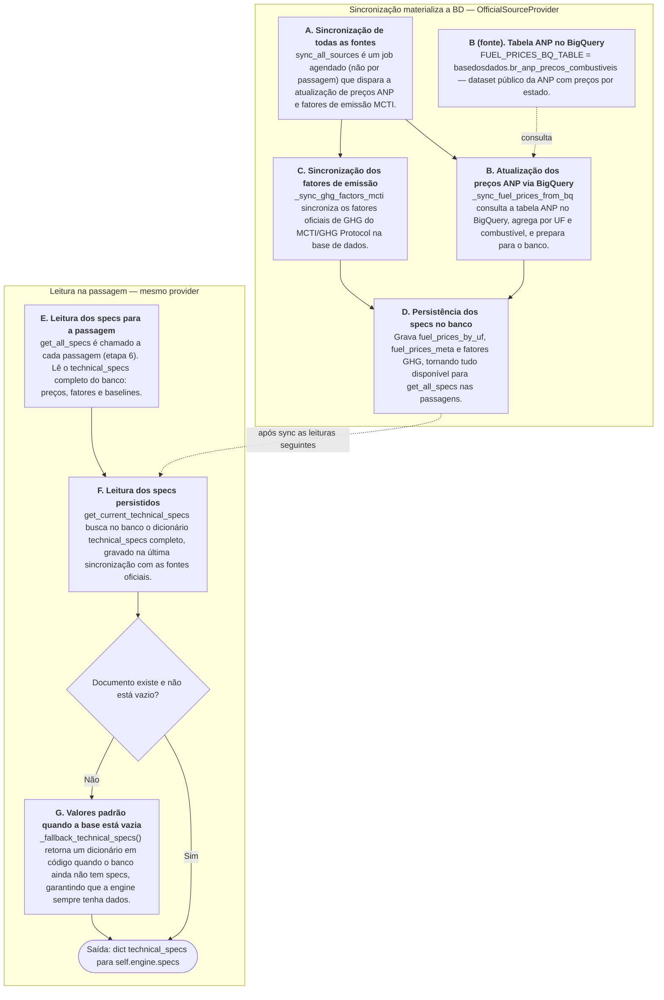

# Motor de cálculo — visão geral (API do motor)

**Índice da pasta** (ordem de leitura, premissas e user stories): [README.md](README.md).

**Este ficheiro:** fluxo em texto, diagramas Mermaid e **contratos de API** (stubs com `pass` são intencionais). **Implementação** (fluxo §3, dicionário §4, código §6, limitações §7): [`engine-calculo.md`](engine-calculo.md). **Exemplo e FAQ:** [`guia-desenvolvedor.md`](guia-desenvolvedor.md).

---

## Fluxo em texto

1. O **webhook** envia tempo de passagem, placa, UF (`uf_passagem` ou `uf`), contexto (`pedagio` / `estacionamento`), `is_digital` e opcionalmente `payback`.
2. **`TransactionOrchestrator.handle_tag_event`** lê o webhook, obtém dados do veículo, atribui `engine.specs` via fonte oficial e chama a engine.
3. **`VehicleDatabase.get_complete_vehicle_data`** devolve `vehicle_data` (BD interno → Senatran → perfil genérico).
4. **`OfficialSourceProvider.get_all_specs`** devolve `technical_specs` persistidos ou `_fallback_technical_specs()`.
5. **`CalcEngine.process_transaction`** devolve o payload (`environmental`, `financial`, `comparison`, `storytelling`, `metadata`, `payback` opcional).

---

## Fluxo sequencial (diagrama)

Fluxo de **chamadas** (não é UML completo), alinhado ao [§6 de engine-calculo.md](engine-calculo.md#6-código-de-referência-python). O ramo **veículo** (placa → `vehicle_data`) resolve BD → Senatran → fallback e **volta** ao `handle_tag_event` antes de `get_all_specs` e `process_transaction`. O diagrama seguinte da classe `OfficialSourceProvider` separa **sync** (job) da **leitura** na passagem.

### Visão geral: webhook até ao payload

```mermaid
flowchart TD
  fimWebhook([Webhook: tempo de passagem, placa, UF e contexto]) --> etapa01_recepcaoHandleTagEvent

  etapa01_recepcaoHandleTagEvent["<b>1. Recepção do webhook</b><br/>handle_tag_event recebe dados do hardware (placa, UF, contexto, tempo) e coordena as etapas de veículo, specs e engine."] --> etapa02_resolverVeiculoGetComplete

  subgraph subgraphVeiculo [Fluxo de dados do veículo]
    direction TB
    etapa02_resolverVeiculoGetComplete["<b>2. Resolução dos dados do veículo</b><br/>get_complete_vehicle_data percorre: base interna → API Serpro/Senatran → perfil genérico. Devolve plate, category, fuel_type e model."] --> decisaoVeiculoNaBaseFrota{Veículo encontrado na frota interna?}
    decisaoVeiculoNaBaseFrota -->|Não| etapa03_consultaSenatranSerpro["<b>3. Consulta à API Serpro/Senatran</b><br/>HTTP GET ao endpoint consultarVeiculoPorPlaca com a placa normalizada para buscar os dados técnicos do veículo."]
    etapa03_consultaSenatranSerpro --> etapa04_traducaoJsonContratoInterno["<b>4. Tradução do JSON da API para o formato interno</b><br/>_map_external_to_internal converte campos da Serpro (peso_bruto_total, combustivel) para o contrato interno (category, fuel_type)."]
    etapa04_traducaoJsonContratoInterno --> etapa05_persistirVeiculoFrota["<b>5. Salvando veículo na base de dados</b><br/>Após resolver os dados via API, save_vehicle persiste o veículo no banco interno para evitar nova consulta nas próximas passagens."]
    etapa03_consultaSenatranSerpro -.->|Falha ou timeout| etapa03_1_fallbackPerfilGenerico["<b>3.1. Perfil de fallback estático (US06)</b><br/>Se a API falhar, usa um perfil padrão seguro (carro leve a gasolina) para não interromper a passagem."]
  end

  decisaoVeiculoNaBaseFrota -->|Sim| etapa06_providerGetAllSpecs
  etapa05_persistirVeiculoFrota --> etapa06_providerGetAllSpecs
  etapa03_1_fallbackPerfilGenerico --> etapa06_providerGetAllSpecs

  etapa06_providerGetAllSpecs["<b>6. Obtenção dos specs técnicos</b><br/>get_all_specs retorna o technical_specs do banco (fatores, preços, baselines). Se vazio, usa os valores padrão em memória."] --> etapa07_injetarSpecsNaEngine

  etapa07_injetarSpecsNaEngine["<b>7. Injeção dos specs na CalcEngine</b><br/>Os specs são atribuídos à instância da CalcEngine, deixando-a pronta para calcular com os valores oficiais atuais."] --> etapa08_calcEngineProcessTransaction

  subgraph subgraphCalcEngine [Processamento da CalcEngine]
    direction TB
    etapa08_calcEngineProcessTransaction["<b>8. Coordenação dos cálculos da passagem</b><br/>process_transaction recebe tempo, veículo, UF e contexto e coordena todos os sub-cálculos, devolvendo o payload completo."] --> etapa09_baselineETempoPoupado["<b>9. Cálculo do tempo poupado</b><br/>Lê avg_wait_sec dos specs para o contexto (pedágio ou estacionamento) e calcula o tempo que o motorista economizou na fila."]
    etapa09_baselineETempoPoupado --> etapa10_marchaLenta["<b>10. Combustível economizado em marcha lenta</b><br/>calculate_avoided_idle_fuel estima os litros que o motor deixou de queimar em ralenti durante o tempo poupado na fila."]
    etapa10_marchaLenta --> etapa11_surtoAceleracao["<b>11. Combustível economizado na aceleração</b><br/>calculate_avoided_acceleration_fuel retorna o volume extra evitado por não parar e acelerar na cabine — valor fixo por categoria nos specs."]
    etapa11_surtoAceleracao --> etapa12_somaLitrosEconomizados["<b>12. Total de litros economizados</b><br/>Soma marcha lenta (etapa 10) e aceleração evitada (etapa 11): volume total de combustível não queimado na passagem."]
    etapa12_somaLitrosEconomizados --> etapa13_ticketDigitalPapelAgua["<b>13. Impacto ambiental do ticket digital</b><br/>calculate_paper_and_water_savings calcula, quando o ticket é digital, o CO₂e, a água e os tickets de papel físico evitados."]
    etapa13_ticketDigitalPapelAgua --> etapa14_emissaoCombustivel["<b>14. Conversão de litros em CO₂e</b><br/>calculate_emissions_from_fuel multiplica os litros economizados pelo fator de emissão do combustível (gasolina, etanol, diesel...) em kg de CO₂e."]
    etapa14_emissaoCombustivel --> etapa15_totalAmbientalPassagem["<b>15. Total de impacto ambiental da passagem</b><br/>Soma o CO₂e do combustível (etapa 14) com o do ticket digital (etapa 13, se aplicável), formando o impacto total evitado."]
    etapa15_totalAmbientalPassagem --> etapa16_cotacaoPorUf["<b>16. Preço do combustível por UF</b><br/>resolve_fuel_price_brl_per_liter busca o R$/litro para a UF da passagem; se não achar, cai no fallback de UF padrão ou preço nacional."]
    etapa16_cotacaoPorUf --> etapa17_snapshotPrecosMetadata["<b>17. Registro de auditoria do preço aplicado</b><br/>Monta o pricing_snapshot: preço usado, UF aplicada, moeda (BRL) e fonte — para rastreabilidade da passagem."]
    etapa17_snapshotPrecosMetadata --> etapa18_economiaFinanceira["<b>18. Economia financeira em reais</b><br/>calculate_financial_savings decompõe a economia: combustível não queimado, desgaste de freio evitado e micro-manutenção, em R$."]
    etapa18_economiaFinanceira --> etapa19_comparativoCenarios["<b>19. Comparação: sem tag vs. com tag</b><br/>build_comparison monta os dois cenários e os deltas de tempo, combustível, CO₂ e R$ entre eles."]
    etapa19_comparativoCenarios --> etapa20_metaforasLegado["<b>20. Metáforas legado (retrocompatível)</b><br/>get_ludic_metrics calcula árvores salvas, cargas de celular e filtros de café a partir do CO₂e total, usando os fatores lúdicos dos specs."]
    etapa20_metaforasLegado --> etapa21_metaforasPorEixo["<b>21. Metáforas visuais por eixo</b><br/>get_ludic_metrics_by_axis gera as listas para a interface, por eixo: carbono (árvores), água (garrafas) e papel (folhas A4)."]
  end

  etapa21_metaforasPorEixo --> etapa22_montagemPayload["<b>22. Montagem do payload final</b><br/>process_transaction reúne: environmental, financial, comparison, storytelling e metadata num único dict de resposta."]

  etapa22_montagemPayload --> decisaoPaybackNoPayload{Payload de entrada inclui bloco payback?}

  decisaoPaybackNoPayload -->|Sim| etapa23_paybackSnapshot["<b>23. Status de payback da tag</b><br/>calculate_payback_snapshot compara a economia acumulada com o total de mensalidades e define o status: tag_paga ou em_payback."]
  etapa23_paybackSnapshot --> fimPayloadJsonAoCaller
  decisaoPaybackNoPayload -->|Não| fimPayloadJsonAoCaller

  fimPayloadJsonAoCaller([Fim: payload JSON devolvido ao caller])

  style subgraphVeiculo fill:#f0f4ff,stroke:#2b5797,stroke-width:2px
  style subgraphCalcEngine fill:#f2fff2,stroke:#107c10,stroke-width:2px
```



Dentro de `build_comparison`, o pseudocódigo reutiliza `calculate_paper_and_water_savings`, `calculate_emissions_from_fuel` e `calculate_financial_savings` para os dois cenários; ver implementação em [`engine-calculo.md`](engine-calculo.md) §6.

> **Mapeamento de combustível / API Senatran:** comportamento e limitações de `_map_external_to_internal` → [§7 Limitações](engine-calculo.md#7-limitações).

### Diagrama da classe `OfficialSourceProvider`

A **sincronização** (BigQuery ANP, fatores MCTI) **não** ocorre em cada webhook na referência §6: costuma ser **job agendado ou arranque** que chama `sync_all_sources` e **popula a BD**. Em cada passagem, `get_all_specs` apenas **lê** a BD (ou usa `_fallback_technical_specs` se ainda não houver documento persistido).



Constante e URLs da tabela ANP: secção [URLs e fontes de dados](#urls-e-fontes-de-dados) deste ficheiro e secção 4 de [`engine-calculo.md`](engine-calculo.md).

---

## URLs e fontes de dados

- **Preços (ANP por UF):** [`basedosdados.br_anp_precos_combustiveis`](https://console.cloud.google.com/bigquery?p=basedosdados&d=br_anp_precos_combustiveis) — sync na aplicação; detalhe em `engine-calculo.md`.
- **Veículo por placa:** [`consultarVeiculoPorPlaca`](https://wsdenatran.estaleiro.serpro.gov.br/v1/api-doc/#/Consulta%20de%20Ve%C3%ADculos/consultarVeiculoPorPlaca) — base `https://wsdenatran.estaleiro.serpro.gov.br/v1`.
- **Constante de referência:** `FUEL_PRICES_BQ_TABLE = "basedosdados.br_anp_precos_combustiveis"`.

---

## `TransactionOrchestrator`

> **Stubs — apenas contratos de API.** Os corpos dos métodos abaixo são intencionalmente `pass`. A implementação completa está em [`engine-calculo.md §6 Bloco 4`](engine-calculo.md#bloco-4--transactionorchestrator).

Ponto de entrada após o webhook: liga `VehicleDatabase`, `OfficialSourceProvider` e `CalcEngine` (sem lógica de cálculo).

```python
from __future__ import annotations

from typing import Any, Dict, Optional

# CalcEngine, VehicleDatabase, OfficialSourceProvider — implementação em engine-calculo.md §6


class TransactionOrchestrator:
    """Coordena webhook → veículo → specs → CalcEngine. Implementação: engine-calculo.md §6 Bloco 4."""

    def __init__(self, engine: CalcEngine, vehicle_db: VehicleDatabase, sources: OfficialSourceProvider) -> None:
        """Injeta engine, base de veículos e provider de specs oficiais."""
        pass

    def handle_tag_event(self, webhook_payload: Dict[str, Any]) -> Dict[str, Any]:
        """
        Lê o payload do webhook, obtém vehicle_data, define self.engine.specs =
        sources.get_all_specs(), lê payback e uf_passagem e delega process_transaction.
        """
        pass
```

---

## `VehicleDatabase`

> **Stubs — apenas contratos de API.** Implementação completa em [`engine-calculo.md §6 Bloco 2`](engine-calculo.md#bloco-2--vehicledatabase).

Resolve `vehicle_data` no contrato da `CalcEngine` (`plate`, `category`, `fuel_type`, `model`, …). Contrato detalhado: `engine-calculo.md`.

```python
from typing import Any, Dict


class VehicleDatabase:
    """Frota interna (BD) + API Senatran + perfil genérico (US06). Implementação: engine-calculo.md §6 Bloco 2."""

    def __init__(self, db_connection: Any, api_credentials: Any) -> None:
        """Guarda acesso à BD interna e credenciais Serpro."""
        pass

    def get_complete_vehicle_data(self, plate: str) -> Dict[str, Any]:
        """BD local → GET Senatran → persistir e devolver → fallback estático se falhar."""
        pass

    def _map_external_to_internal(self, plate: str, raw: Dict[str, Any]) -> Dict[str, Any]:
        """
        Traduz JSON da API Senatran para o dicionário interno esperado pela engine.
        Mapeamento: diesel → diesel_s10; etanol/alcool puro → etanol; flex/demais → gasolina_c.
        Ver engine-calculo.md §6 Bloco 2 e §7 Limitações (flex, GNV, elétrico).
        """
        pass
```

---

## `_fallback_technical_specs` e `OfficialSourceProvider`

> **Stubs — apenas contratos de API.** Implementação completa em [`engine-calculo.md §6 Bloco 3`](engine-calculo.md#bloco-3--officialsourceprovider-e-_fallback_technical_specs).

Fornecem `technical_specs` para `self.specs` na `CalcEngine`. Fallback: defaults quando a BD ainda não tem specs (chaves e exemplos na §4 de `engine-calculo.md`).

```python
from typing import Any, Dict

FUEL_PRICES_BQ_TABLE = "basedosdados.br_anp_precos_combustiveis"


def _fallback_technical_specs() -> Dict[str, Any]:
    """Retorna dict completo de specs quando a BD ainda não tem documento persistido (estrutura na §4 de engine-calculo.md)."""
    pass


class OfficialSourceProvider:
    """Sincroniza fontes oficiais e expõe get_all_specs para a orquestração. Implementação: engine-calculo.md §6 Bloco 3."""

    def __init__(self, db: Any) -> None:
        """Referência à camada de persistência dos technical_specs."""
        pass

    def sync_all_sources(self) -> None:
        """Dispara _sync_fuel_prices_from_bq e _sync_ghg_factors_mcti."""
        pass

    def _sync_fuel_prices_from_bq(self) -> None:
        """
        Popula a BD com fuel_prices_by_uf e fuel_prices_meta a partir de FUEL_PRICES_BQ_TABLE
        (cliente BigQuery + agregação por UF na camada de dados).
        """
        pass

    def _sync_ghg_factors_mcti(self) -> None:
        """Sincroniza ou materializa fatores oficiais MCTI / GHG Protocol."""
        pass

    def get_all_specs(self) -> Dict[str, Any]:
        """Lê specs atuais da BD ou devolve _fallback_technical_specs() se vazio."""
        pass
```

---

## `_default_ludic_metaphors` e `CalcEngine`

> **Stubs — apenas contratos de API.** Implementação completa em [`engine-calculo.md §6 Bloco 1`](engine-calculo.md#bloco-1--calcengine).

Núcleo do payload da passagem. `get_ludic_metrics_by_axis` usa `_default_ludic_metaphors()` quando `specs` não define `ludic_metaphors`.

```python
from __future__ import annotations

from typing import Any, Dict, List, Optional


def _default_ludic_metaphors() -> Dict[str, List[Dict[str, Any]]]:
    """Metáforas por eixo (carbon, water, paper) quando ausentes em specs; valores revisáveis na §4."""
    pass


class CalcEngine:
    """Motor de impacto ambiental/financeiro e storytelling por passagem. Implementação: engine-calculo.md §6 Bloco 1."""

    def __init__(self, technical_specs: Dict[str, Any]) -> None:
        """Atribui self.specs (contrato technical_specs na §4 de engine-calculo.md)."""
        pass

    # --- Conversão universal (pivo CO₂e) ---

    def convert_to_co2(self, value: float, unit: str) -> float:
        """
        Normaliza qualquer unidade de entrada para kg CO₂e (pivo).
        Ponto de extensão: para suportar nova unidade de entrada, adicione um branch aqui.
        unit: water_liters, paper_tickets, fuel_liters_<tipo>.
        Não é chamado em process_transaction (que calcula o pivo diretamente); é o
        contrato público para chamadores externos que normalizam unidades heterogêneas.
        """
        pass

    def convert_from_co2(self, co2_kg: float, target_unit: str) -> float:
        """
        Converte kg CO₂e para unidade simbólica (pivo inverso).
        Ponto de extensão: para adicionar/remover metáfora de saída, altere specs['benchmarks']
        e acrescente/remova uma chave — sem mudar a lógica de cálculo principal.
        target_unit: trees, water, smartphone, km_driven, burgers.
        """
        pass

    # --- Ambiental ---

    def calculate_emissions_from_fuel(self, liters: float, fuel_type: str) -> float:
        """CO₂e a partir de litros economizados e fatores em specs."""
        pass

    def calculate_avoided_idle_fuel(self, time_saved_sec: int, category: str) -> float:
        """Litros de marcha lenta evitados no tempo poupado na fila."""
        pass

    def calculate_avoided_acceleration_fuel(self, category: str) -> float:
        """Litros de combustível do consumo extra ao acelerar após uma paragem (fixo por passagem, por categoria)."""
        pass

    def calculate_paper_and_water_savings(self, is_digital: bool) -> Dict[str, float]:
        """Impacto de um ticket digital (CO₂, água, paper_tickets) vs. ausência (US04)."""
        pass

    # --- Financeiro ---

    def resolve_fuel_price_brl_per_liter(self, uf_passagem: str, fuel_type: str) -> tuple[float, str]:
        """Determina preço em R$/litro e UF efetiva para o snapshot (fallbacks em specs)."""
        pass

    def calculate_financial_savings(
        self,
        idle_liters: float,
        accel_liters: float,
        fuel_type: str,
        category: str,
        fuel_price_brl_per_liter: float,
        stops_avoided: int = 1,
    ) -> Dict[str, Any]:
        """
        Decomposição em combustível (marcha lenta + consumo extra após paragem), desgaste de
        travões por paragem na cabine de pedágio, manutenção e total em R$; alinhado a
        metadata.pricing_snapshot.
        """
        pass

    # --- Cenários ---

    def build_comparison(
        self,
        baseline_time_sec: int,
        real_time_sec: int,
        vehicle_data: Dict[str, Any],
        is_digital: bool,
        fuel_price_brl_per_liter: float,
    ) -> Dict[str, Any]:
        """
        US05: sem tag (espera plena + consumo extra após paragem) vs. com tag (tempo real,
        sem esse consumo extra modelado); mesmo R$/litro nos dois ramos.
        Internamente chama calculate_financial_savings para AMBOS os cenários como modelo
        de custo de cada ramo — o 'delta.estimated_brl' é a economia real resultante.
        """
        pass

    # --- Storytelling ---

    def get_ludic_metrics(self, total_co2_avoided: float) -> Dict[str, Any]:
        """Métricas legado (árvores, cargas de telemóvel, filtros de café) a partir de ludic_factors."""
        pass

    def get_ludic_metrics_by_axis(
        self,
        total_co2_kg: float,
        water_liters: float,
        paper_tickets: float,
    ) -> Dict[str, List[Dict[str, Any]]]:
        """Lista de metáforas por eixo carbon, water, paper a partir de specs ou default (US02)."""
        pass

    # --- Payback ---

    @staticmethod
    def calculate_payback_snapshot(
        accumulated_savings_brl: float,
        monthly_tag_fee_brl: float,
        billing_months: float = 1.0,
    ) -> Dict[str, Any]:
        """Estado de payback (taxas, líquido, status tag_paga / em_payback) a partir de acumulado e mensalidade (US11)."""
        pass

    # --- Orquestração ---

    def process_transaction(
        self,
        real_time_sec: int,
        vehicle_data: Dict[str, Any],
        context: str,
        uf_passagem: str,
        *,
        is_digital: bool = True,
        payback: Optional[Dict[str, Any]] = None,
    ) -> Dict[str, Any]:
        """
        Monta environmental, financial, comparison, storytelling, metadata;
        inclui payback se o bloco opcional vier no input.
        """
        pass
```

---

## Topo do payload (`process_transaction`)

| Chave | Propósito |
|-------|-----------|
| `environmental` | Totais ambientais da passagem. |
| `financial` | Economia em R$ (combustível, freio, manutenção, total). |
| `comparison` | Sem tag vs. com tag e deltas. |
| `storytelling` | `legacy` e `by_axis` para UI. |
| `metadata` | Tempos, contexto, `is_digital`, UF, `pricing_snapshot`. |
| `payback` | Só se o input trouxer o bloco opcional. |

Contratos de campos: [`engine-calculo.md`](engine-calculo.md).

---

## Documentação complementar

- **Índice da pasta e ordem de leitura:** [README.md](README.md).
- **Código de referência e spec fino:** [`engine-calculo.md`](engine-calculo.md) (§3–§7, código §6).
- **Guia com exemplo e FAQ:** [`guia-desenvolvedor.md`](guia-desenvolvedor.md).
- **Revisão US, TODOs §6, melhorias conhecidas:** [`engine-debitos-e-backlog.md`](engine-debitos-e-backlog.md).
- Em caso de divergência entre este índice e o spec, prevalece `engine-calculo.md` até alinhamento explícito.
